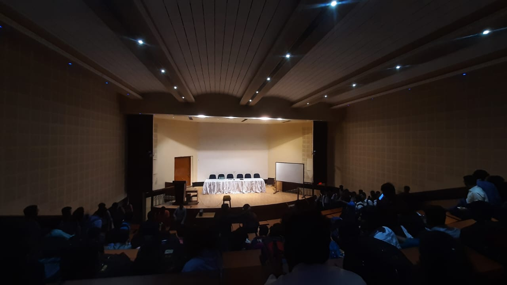
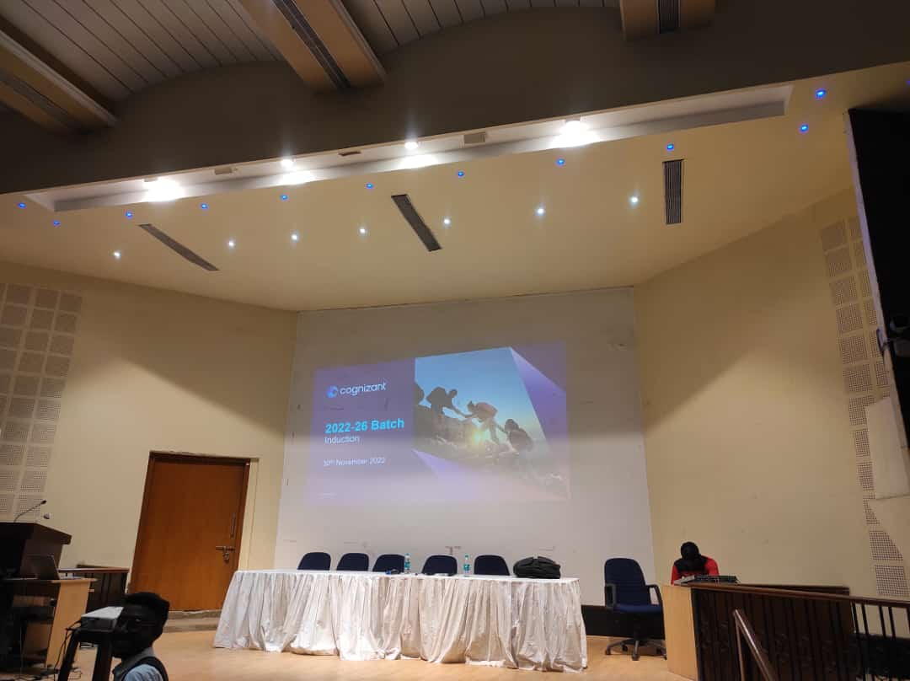

# Cognizant Technology Solutions Seminar 30 November 2022

The Cognizant Technology Solutions seminar held at our college was an excellent opportunity for us to learn about the company's services, culture, and career opportunities. As students, we were required to dress in formal attire, which was essential to creating a professional atmosphere for the seminar. During the seminar, we interacted with Cognizant representatives who were highly knowledgeable and provided us with valuable insights into the IT industry. We learned about the latest technologies, trends, and skills required to succeed in the industry. The seminar was highly informative, and the Cognizant representatives answered all our queries patiently. We also learned about the company's culture, values, and the different job roles available. The experience of dressing formally for the seminar was a unique experience for me. It was a reminder of the importance of dressing professionally in a corporate setting and the impact it can have on how we are perceived by others. It was also a great opportunity to present ourselves in the best possible light and show our respect for the company and the event. Overall, the Cognizant seminar was an enriching and educational experience that gave us a glimpse into the world of IT services. It was an opportunity to learn from industry professionals, gain valuable insights, and make connections that could help us in our future careers. I am grateful to have been a part of this seminar and look forward to similar opportunities in the future.

#### College Auditorium:

 

  
Other Images

   
   
   
   
   
  <!--  -->
   
   
   
  <!--  -->
  <!--  -->
  <!--  -->
   
   
   
   

