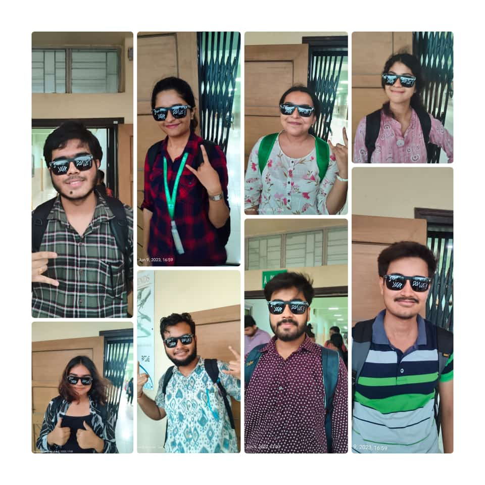
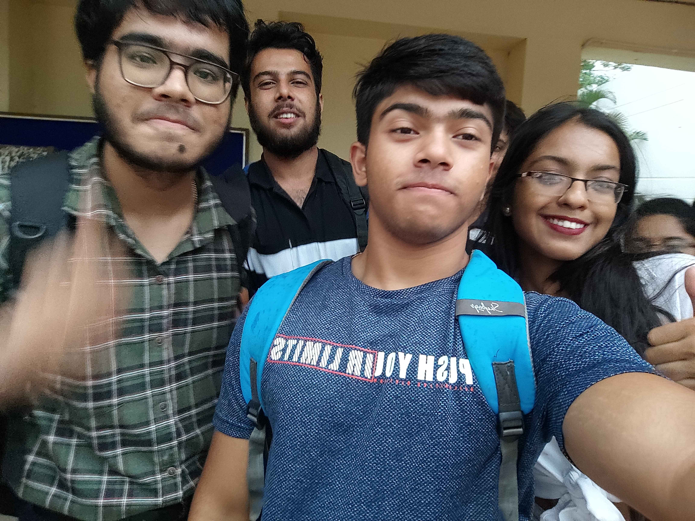
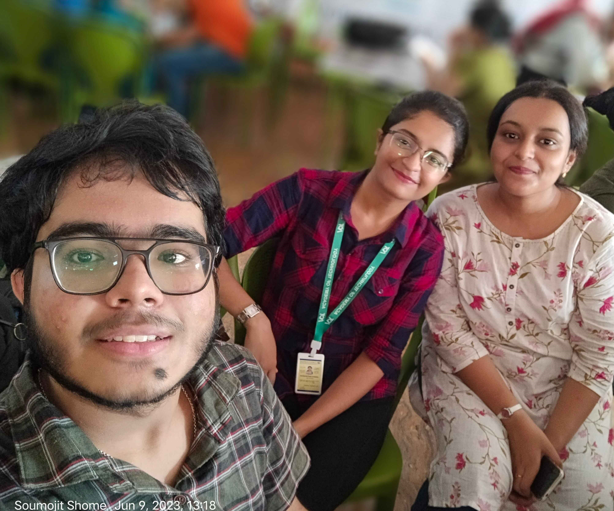
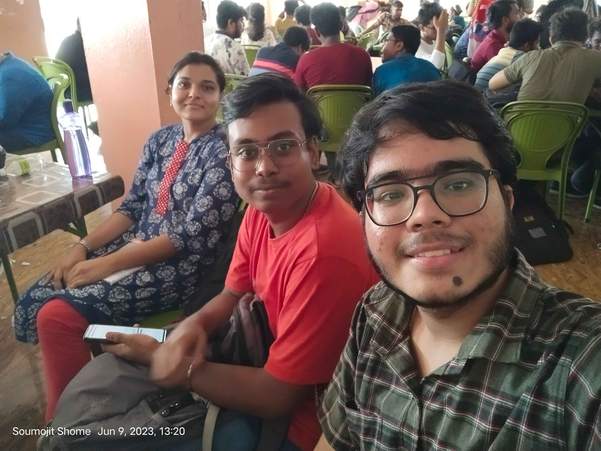
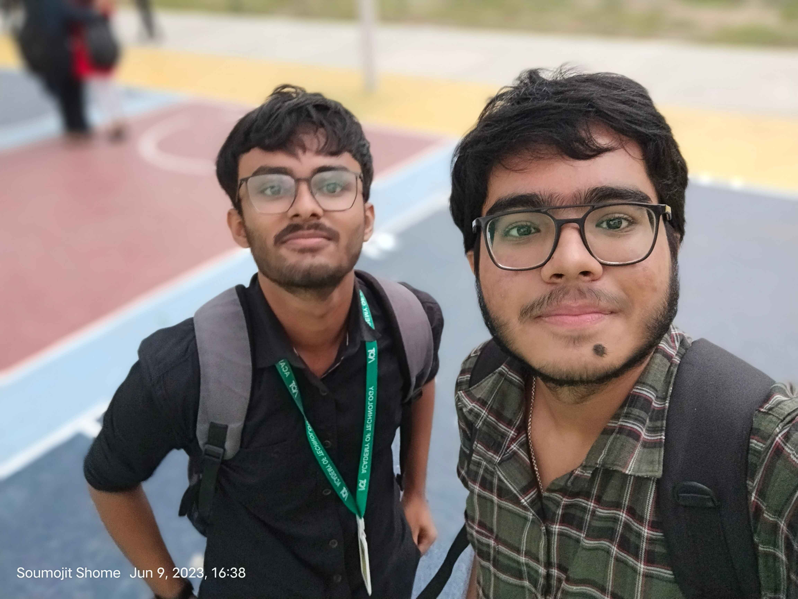
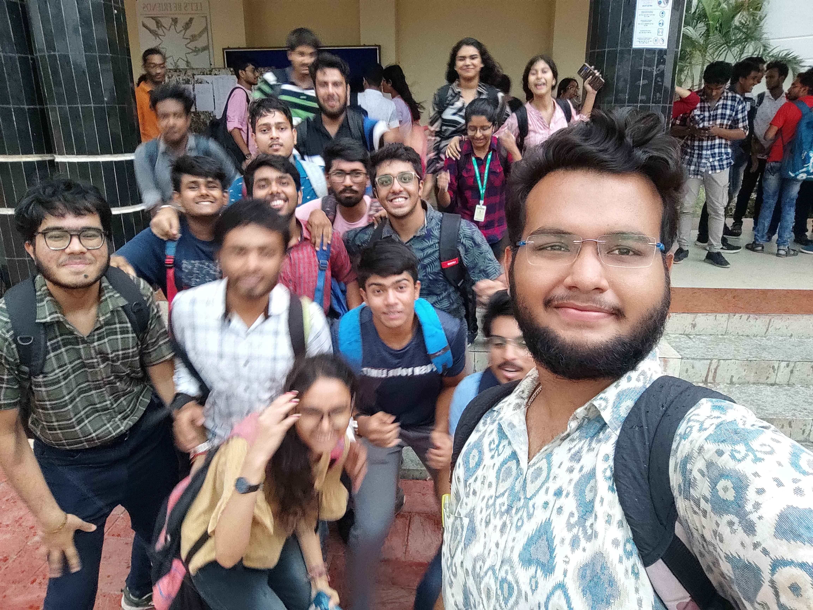
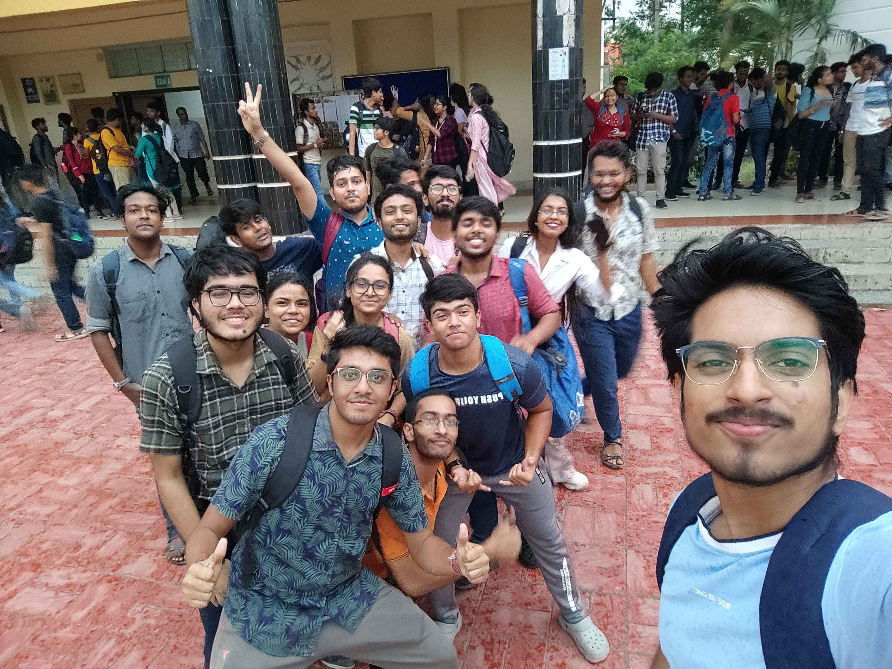
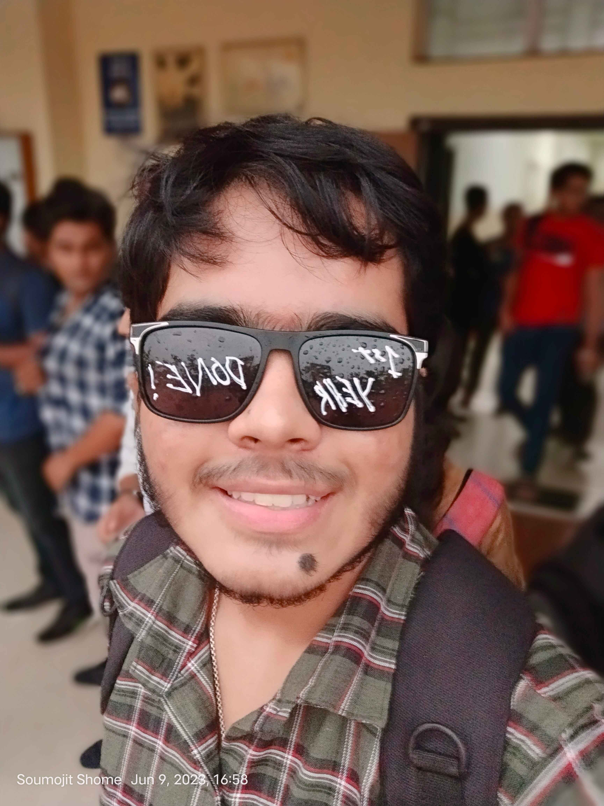
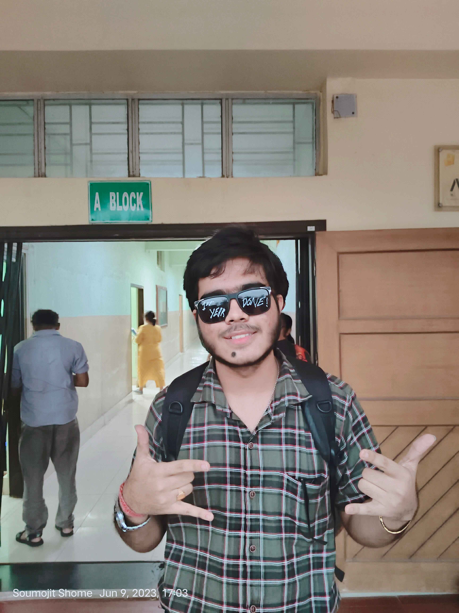

# 1st Year Done 9 June 2023

My first year of college has come to an end, and what an incredible journey it has been! The last day was filled with joy, laughter, and unforgettable memories that will forever hold a special place in my heart. Here's to the end of my first year, a year that will forever be etched in my memory. With a grateful heart and a renewed spirit, I look forward to the next chapter of my college journey, knowing that the last day of my first year will always hold a special place in my heart.

Dear friends, Your presence in my life has brought immense joy, support, and countless cherished memories. I am grateful for the laughter we've shared, the memories we've created, and the bond that ties us together. Your friendship has made my college experience unforgettable.

Thanks a lot

  
  
  
  
  
  
  
  
  