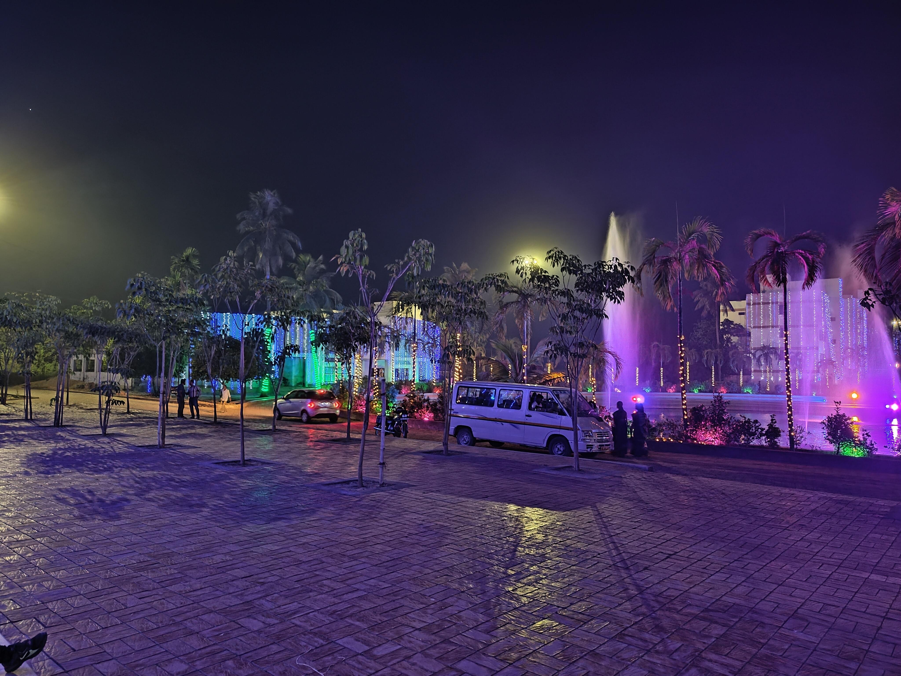
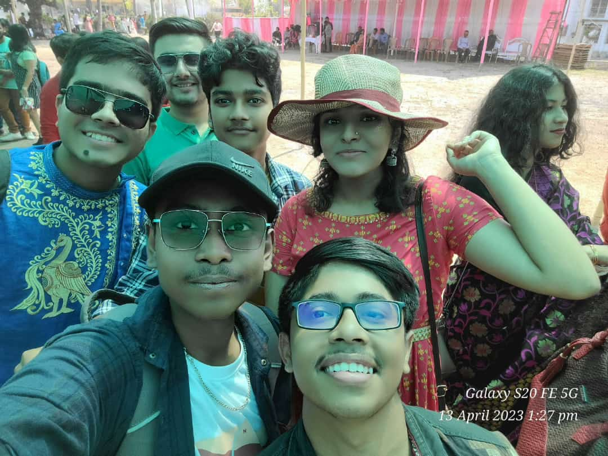
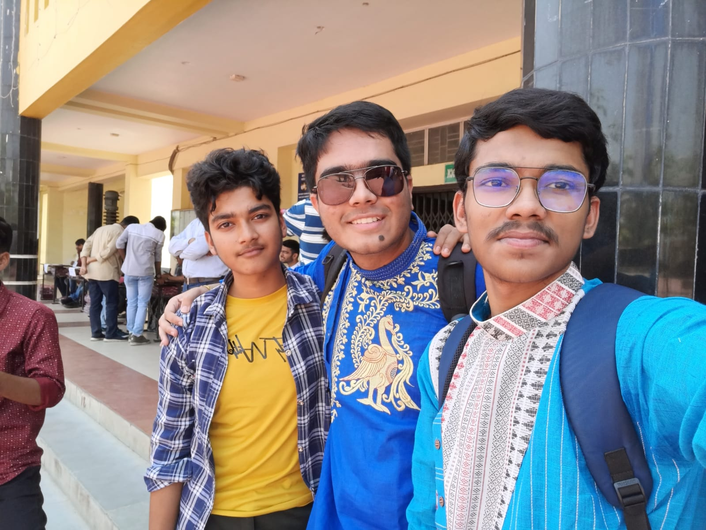
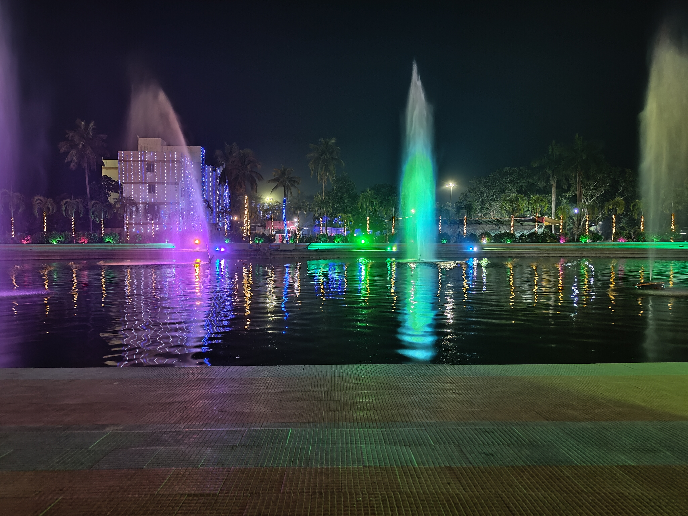
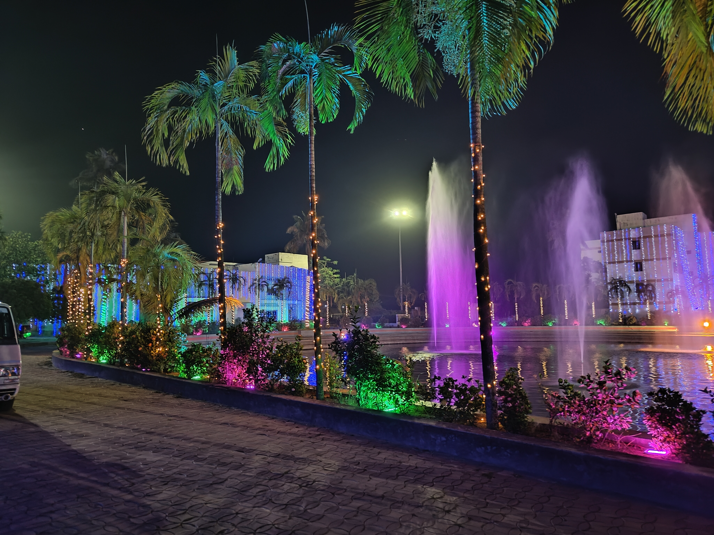

# ARCADIA 14 April 2023

Armaan Malik, the popular Indian singer, recently performed at your college, and it was a fantastic experience for everyone in attendance. Armaan Malik is known for his melodious voice and has a vast following among the youth. His performance was likely a highly anticipated event, and it did not disappoint. The atmosphere was likely electric as students eagerly awaited the start of the show. As soon as Armaan Malik took the stage, the energy in the room likely intensified, and students started singing and dancing along to his hit songs. The performance was likely a mix of his popular tracks and some of his lesser-known songs, which allowed the audience to enjoy a range of music. Armaan Malik's performance was likely a memorable experience for all those in attendance, providing a much-needed break from the rigors of academic life. It was an opportunity to unwind, have fun, and create lasting memories with friends and classmates.

  
  
  
  
  
  
  
  
  
  
  