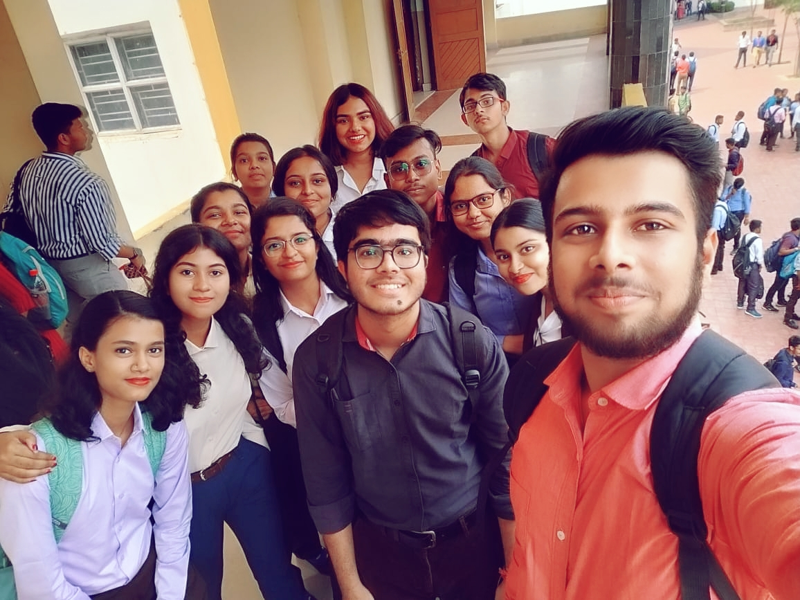
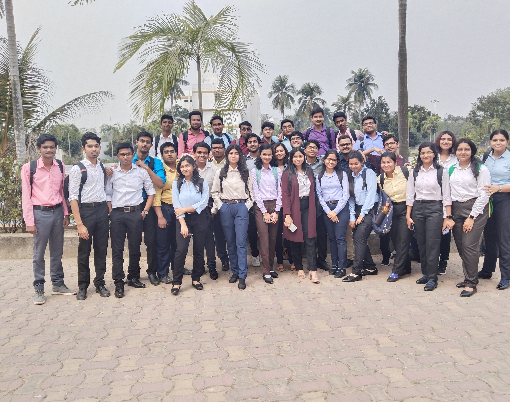
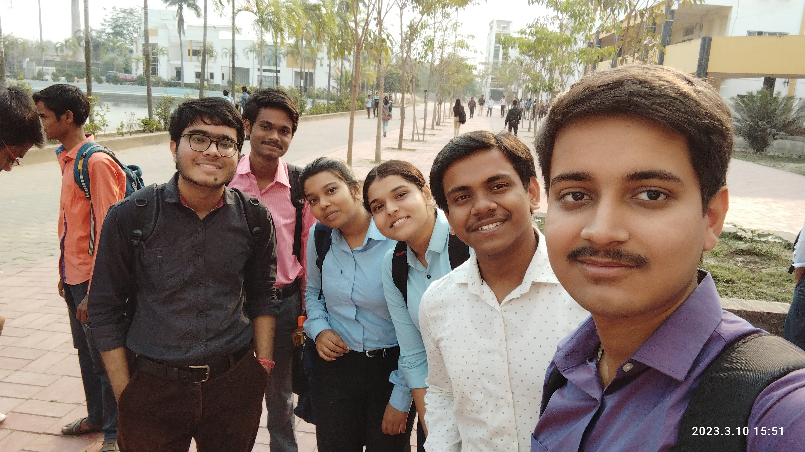
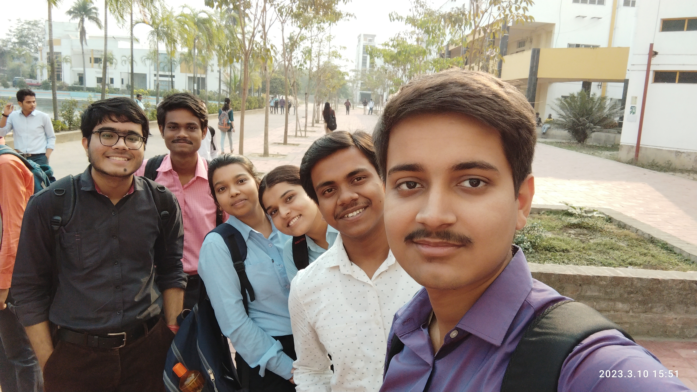
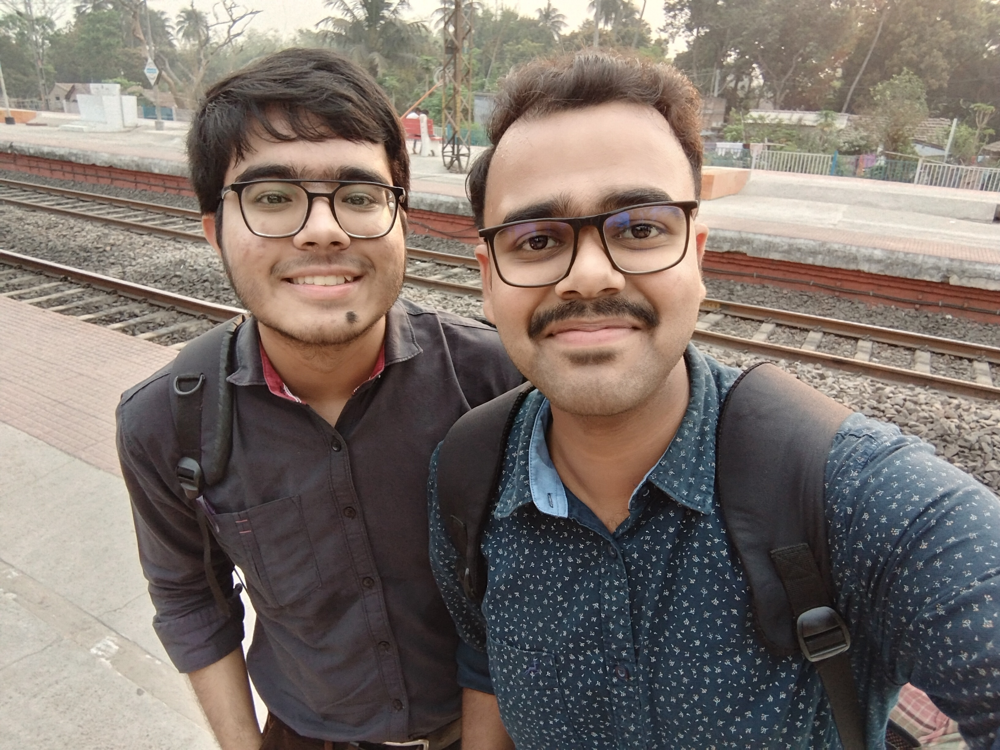

# TCS Seminar 10 March 2023

Tata Consultancy Services (TCS) recently organized a seminar at our college, and all attendees were required to wear formal dress.The formal dress code was likely implemented to convey a sense of respect for the company and the event.
During the seminar, students likely had the opportunity to learn about TCS, its services, and its culture. This type of event can be an excellent opportunity for students to gain insights into the professional world, network with industry professionals, and learn about potential career paths.
By dressing formally, students were able to demonstrate their respect for the company and the seminar, as well as convey a sense of professionalism and seriousness about their future careers. Overall, the seminar was likely an informative and educational experience that provided valuable insights into the world of IT and consulting.

  
  
  
  
  
  
  