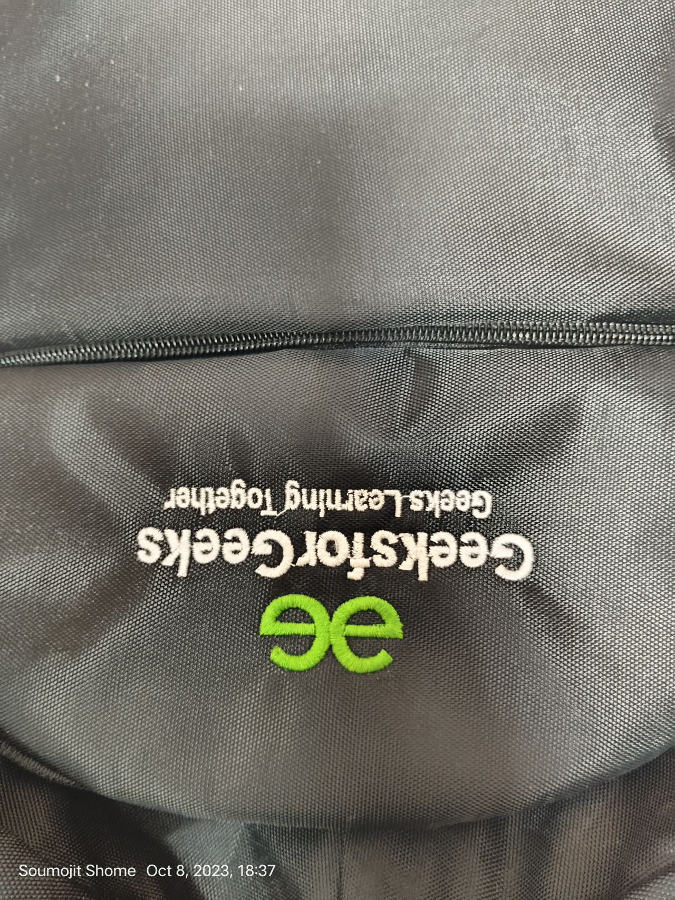
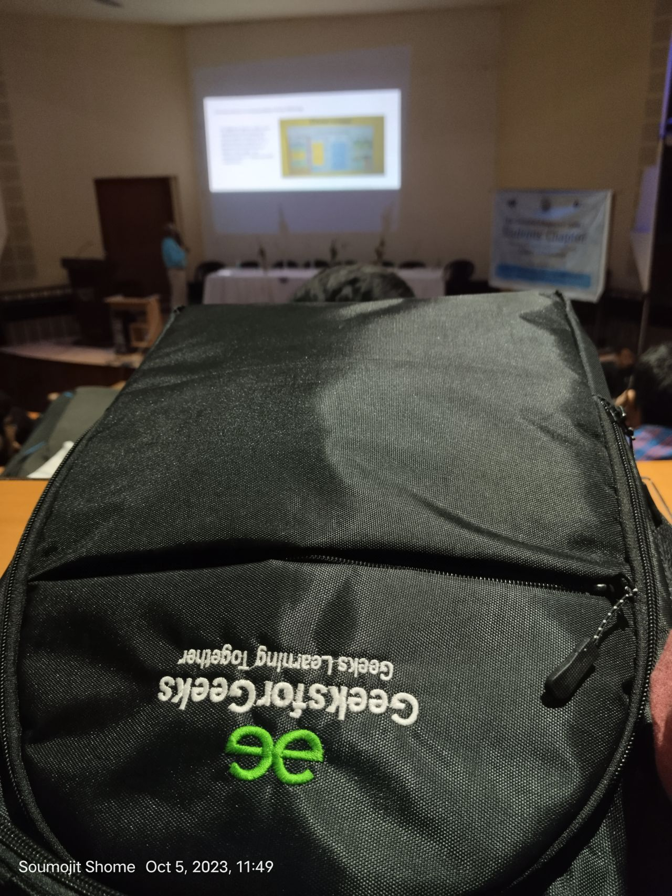
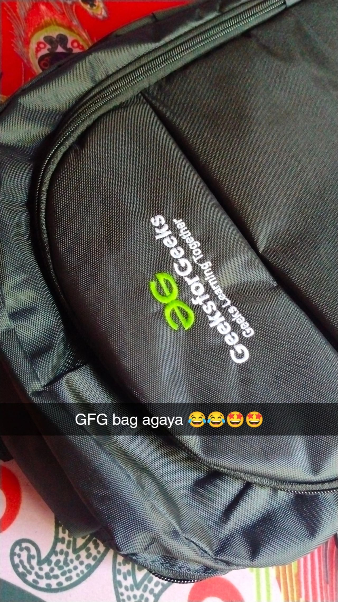
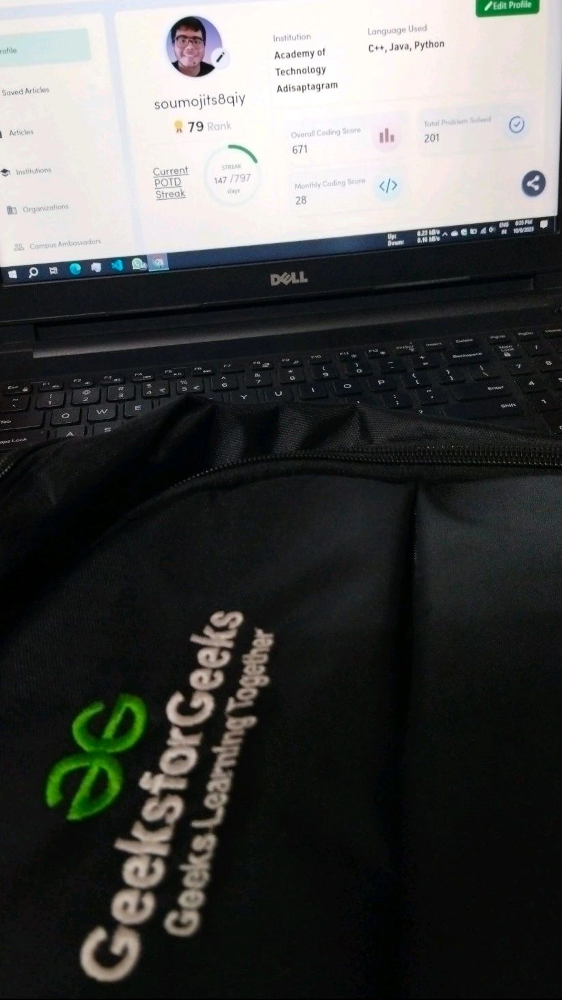

# GeeksforGeeks Bag
- Date : 5 Oct 2023

I'm excited to receive my GeeksforGeeks bag! 🎉 It's more than just a bag, it represents my passion for coding and learning. Thanks, GFG, for being my constant source of knowledge and inspiration. Ready to carry my geeky spirit wherever I go! 💼 🥳🎉🎉

Thanks to GeeksforGeeks and Sandeep Jain sir for providing this wonderful platform. 🔥

#gfg #geeksforgeeks #codingjourney #codingchallenge #gfgbag

<!--  -->

 