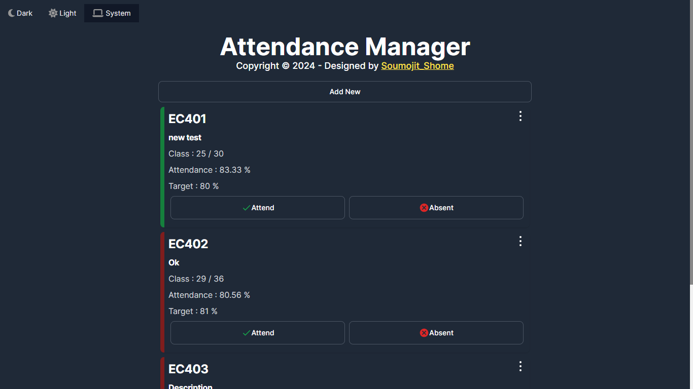

# [Attendance Manager](https://myattendance.vercel.app/)

## 🎉 Exciting News! Just Launched My Attendance Manager WebApp with Next.js! 🌐✨ 

Hey everyone! I'm super excited to share my latest project – a cool Attendance Manager WebApp built using Next.js! 🚀✨

This is an Attendance Manager Website built using Next.js and Firebase. It provides features to manage attendance for classes including adding class cards, editing cards, marking attendance with attend and absent buttons, deleting classes, resetting attendance, implementing authentication via Google and email/password, and supporting light and dark themes. Additionally, it allows setting a target percentage attendance and viewing current attendance percentage.

🔥 **Version : V 1.0.0**

🔥 **Project Link :** [Click to Visit Website](https://myattendance.vercel.app/)

🔥 **Video Link :** [Click to Visit YouTube Video](https://youtu.be/YCaD11BteE0?si=lRdmh5BALvnVzy-q)

🔥 **LinkedIn Post Link :** [Click to Visit LinkedIn Post](https://www.linkedin.com/posts/soumojit-shome_nextjs-webdevelopment-activity-7178033965511897089-4OhZ?utm_source=share&utm_medium=member_desktop)

## ✨ **Awesome Features:**

1. **Add Class Card:** Users can add new class cards specifying class details such as name, description, etc.

2. **Edit Card:** Users can edit existing class cards to update information like class name, description, etc.

3. **Attend Class Button:** Ability to mark attendance for a class by clicking on the "Attend" button.

4. **Absent Button:** Option to mark a student absent for a class by clicking on the "Absent" button.
   
5. **Delete Option:** Users can delete class cards if they are no longer needed.

6. **Reset Option:** Provides the functionality to reset attendance for a particular class.

7. **Google and Email/Password Sign-in Option:** Users can sign in using their Google accounts or via email/password.

8. **Light/Dark Theme:** Supports both light and dark themes for better user experience.
   
9. **Target % Attendance Option:** Users can set a target percentage attendance for each class.
   
10. **Current Attendance % Option:** Displays the current attendance percentage for each class.

## ✨**Technologies Used :**
   **Next.js:** Framework for building React applications.
   **Firebase:** Backend-as-a-Service platform used for authentication and database management.
   **Tailwind CSS:** Styling the website and implementing light and dark themes.
  
## ✨ **Usage :**
1. Sign in using Google account or email/password.
2. Add class cards by clicking on the "Add New" button.
3. Edit class cards if needed.
4. Mark attendance by clicking on the "Attend" button or "Absent" button.
5. Delete class cards if necessary.
6. Reset attendance for a particular class if needed.
7. Set target percentage attendance for each class.
8. View current attendance percentage for each class.
   

## ✨ **Page Pic:**
 

---

## 🚀 **Video:**

<iframe width="100%" height="315" src="https://www.youtube.com/embed/YCaD11BteE0?si=DZKCRJqc2pMS4BSg" title="YouTube video player" frameborder="0" allow="accelerometer; autoplay; clipboard-write; encrypted-media; gyroscope; picture-in-picture; web-share" allowfullscreen></iframe>

---

## 🚀 **LinkedIn Post:**

<iframe src="https://www.linkedin.com/embed/feed/update/urn:li:share:7178033962244562944" height="500" width="100%" frameborder="0" allowfullscreen="" title="Embedded post"></iframe>

#NextJS #WebDevelopment
Check out the app [Click to Visit Website](https://myattendance.vercel.app/)

## **Thank You...** 🙂🤗