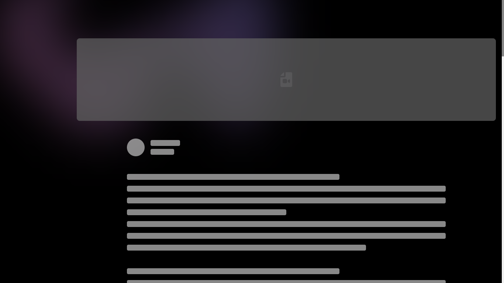

# [Blog WebApp](https://andromedablog.vercel.app/)

### 🚀 Excited to announce the launch of my new blog website (Andromeda Blog)! 🎉

Built with Next.js, Tailwind CSS, and MongoDB, this platform offers a seamless blogging experience with a variety of features.

### 🔥 Version : V 1.0.0

### 🔥 Project Link : [Click to Visit Website](https://andromedablog.vercel.app/) ✨
### 🔥 LinkedIn Post Link : [Click to Visit Post](https://www.linkedin.com/posts/soumojit-shome_nextjs-tailwindcss-mongodb-activity-7215268780577292288-FfeR) ✨

## 🎉 Features :

1. 📝  **Blog Management** : Create, edit, and delete blogs using a rich text editor.

2. 💬  **Comments** : Add, reply to, edit, and delete comments on blogs.

3. 😍  **Reactions** : Express yourself with six types of reactions on blogs: like, love, haha, wow, sad, and angry.

4. 🔖  **Bookmarking** : Save and organize your favorite blogs.

5. 📚  **Feed** : Enjoy a randomized feed of blogs for fresh content every time you visit.

6. 👥  **User Management** :

* **User Section** : View and manage users.
* **User Profile** : View and edit your profile.
* **Edit User Profile** : Update your user profile information.
* **Randomize Users** : View a randomized list of users.

7. 🔐  **Authentication** :

* **Login** : Sign in to your account.
* **Logout** : Sign out of your account.
* **Signup** : Create an account with password, email, and OTP verification.
* **Forgot Password** : Easily reset your password if you forget it.

8. 📝  **User Blogs** :

* **Public Blogs** : View your public blogs.
* **Saved Blogs** : View your bookmarked blogs.
* **Liked Blogs** : View blogs you have reacted to.
* **Commented Blogs** : View blogs you have commented on.

9. 🌟  **Profile Customization** :

* **Change Username** : Update your username.
* **User Display Picture** : Upload and change your profile picture.
* **Cover Picture** : Upload and change your cover picture.
* **About Section** : Add and update your personal bio.
* **Social Profiles** : Add links to your social media profiles.
* **Address** : Add your address information.

10. 🎨 **Personalize Your Space**: Choose between a light or dark theme to make the app look just the way you like it. It's all about making your experience enjoyable!

## 🔮 Future Plans :

* Enhanced rich text editor
* UI updates
* Notification system
* Rich text formatting in comments
* Reactions for comments
* N-level Nested comment sections
* Passwordless authentication
* Advanced analytics and reporting
* AI-powered content suggestions
* Multi-language support
* Integration with third-party services

## 🛠️ Tech Stack :

This project utilizes the following technologies:

* **Next.js** : A React framework for building server-side rendered and static web applications.
* **MongoDB** : A NoSQL database for storing application data.
* **jsonwebtoken** : A library for creating and verifying JSON Web Tokens (JWT) for authentication.
* **Tailwind CSS** : A utility-first CSS framework for designing responsive user interfaces.
* **bcrypt** : A library for hashing passwords.
* **Cloudinary** : A cloud-based service for managing images and videos.
* **cookie-parser** : Middleware for parsing cookies.
* **GitHub** : Version control and collaboration platform.
* **nextjs-toploader** : A loading indicator component for Next.js.

 

 

 

 

 

## ✨ Screenshots

### ✨ First Load Page: 

### ✨ Feed :

### ✨ Loading Skeleton :

### ✨ User Profile :

### ✨ Edit User Profile :

### ✨ User Blog Section :

### ✨ Create Blog Section :

### ✨ Users Section :

### ✨ Blog Page :

### ✨ Blog Reaction Section :

### ✨ Blog Comment Section :

Check it out and start blogging today! [https://andromedablog.vercel.app/](https://andromedablog.vercel.app/)

WebSite Link : [Click to Visit Website](https://andromedablog.vercel.app/)

#NextJS #TailwindCSS #MongoDB #WebDevelopment #Blogging #Tech #NewProject

## Thank You ...