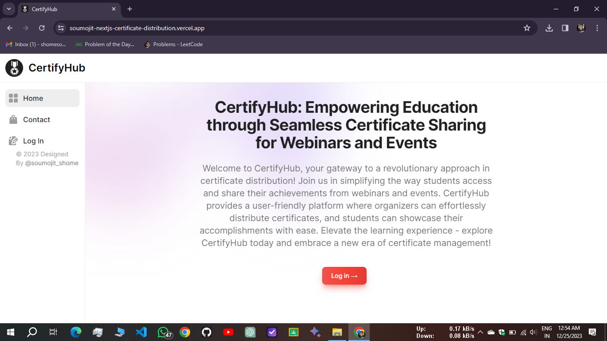
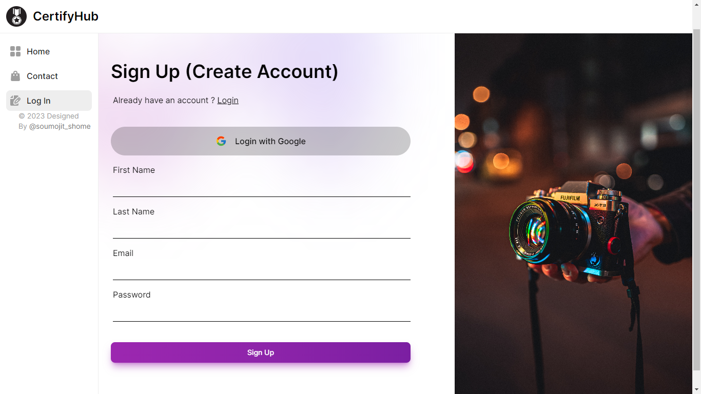
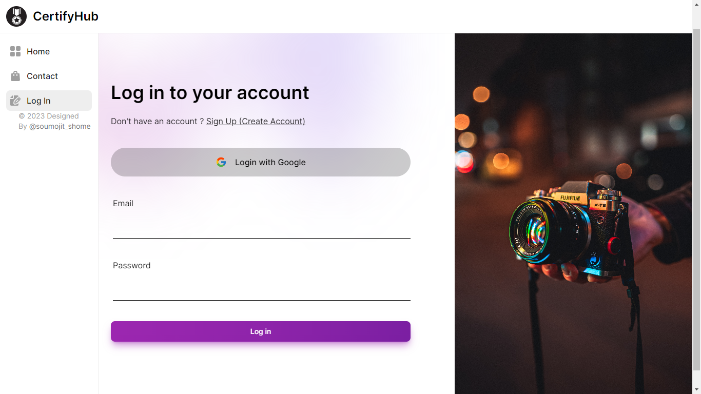
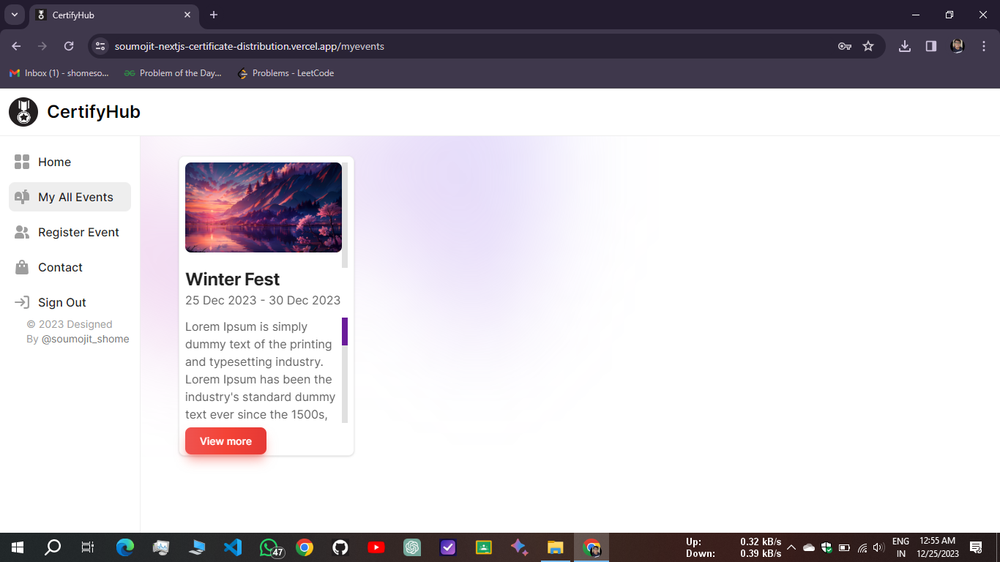
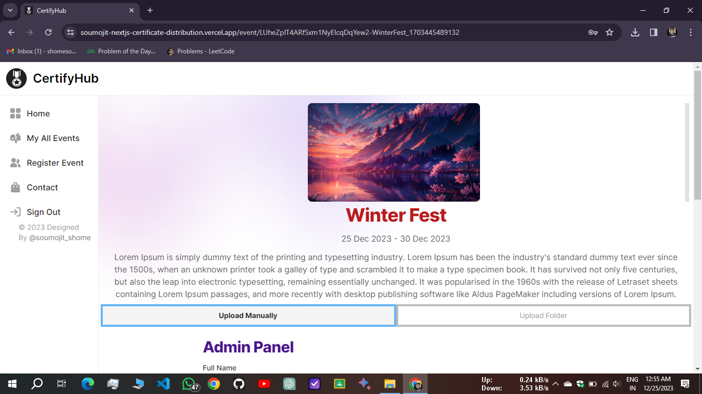
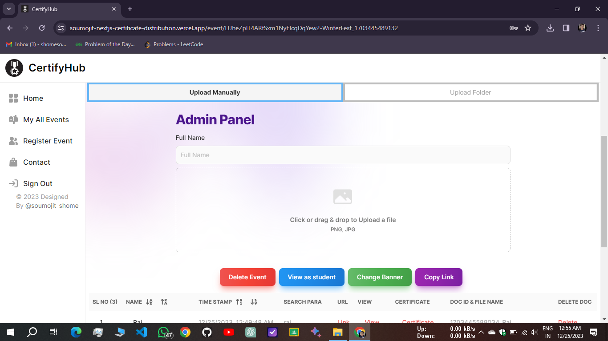
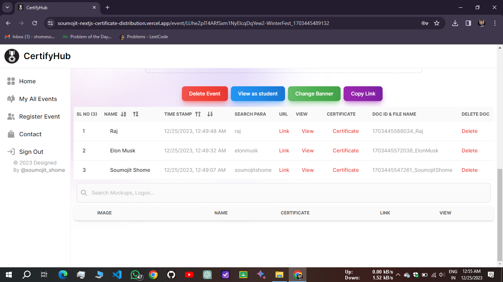
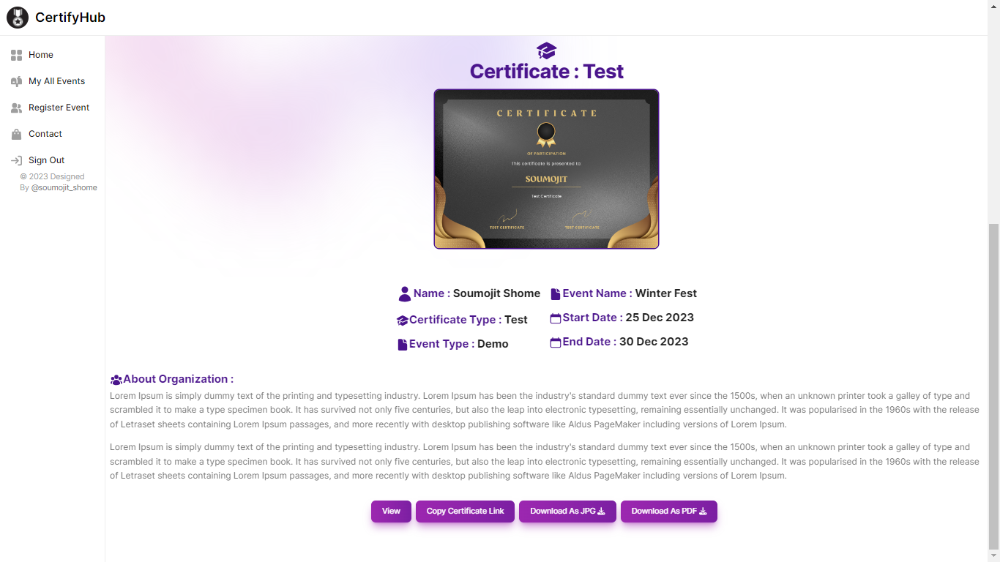

# [CertifyHub](https://soumojit-nextjs-certificate-distribution.vercel.app)

##  🚀 Exciting News: Introducing CertifyHub - Your Ultimate Certificate Distribution Hub! 🚀

🌐 **Revolutionizing Certificate Management with Next.js, Firebase, and Tailwind CSS!**

I'm thrilled to share my latest project, CertifyHub - a cutting-edge Certificate Distribution WebApp that brings simplicity and efficiency to the world of credential management. 🎓✨

🔑 **Key Features:**

1. **Seamless Authentication:**

   - Sign up and log in effortlessly with Google or email/password credentials.
   - Hassle-free password recovery with a forget password feature.
2. **Event Registration Made Easy:**

   - Streamline event management with a user-friendly registration system.
3. **Effortless Certificate Upload:**

   - Manual certificate upload for ultimate flexibility.
   - Bulk upload entire certificate folders for a time-saving solution.
4. **Smart Search Functionality:**

   - Easily find certificates by name, ensuring quick access to the information you need.
5. **Dual Panel System:**

   - Empower administrators and students with dedicated panels for efficient control.
6. **Event Deletion for Admins:**

   - Admins have the power to manage events seamlessly, including event deletion.
7. **Shareable Certificate Links:**

   - Generate unique links for specific certificates, allowing students to easily share their achievements.
8. **Drag-and-Drop File Upload:**

   - Intuitive file upload with drag-and-drop functionality for a seamless user experience.

🎉 **Why CertifyHub?**

CertifyHub goes beyond traditional certificate distribution, offering a robust platform that caters to the needs of both administrators and students. The user-friendly interface, coupled with powerful features, ensures a hassle-free experience for all stakeholders involved.

🚀 **Ready to Elevate Your Certificate Management Game? Join CertifyHub Today! 🚀**

WebSite Link : [https://soumojit-nextjs-certificate-distribution.vercel.app](https://soumojit-nextjs-certificate-distribution.vercel.app/)

Video Link : [https://youtu.be/WN1OPVST94k](https://youtu.be/WN1OPVST94k)

LinkedIn Post Link : [Click to Visit LinkedIn Post](https://www.linkedin.com/posts/soumojit-shome_certifyhub-certificatedistribution-nextjs-activity-7144924837470191616-Z34S)

#### 🚀 Home Page:

#### 🚀 Sign Up Page:

#### 🚀 LogIn Page:

#### 🚀 My Events Page:

#### 🚀 Event Page:

#### 🚀 Admin Page:

#### 🚀 Uploaded Certificate:

#### 🚀 Certificate Page:

---

#### 🚀 Video:

<iframe width="100%" height="315" src="https://www.youtube.com/embed/WN1OPVST94k?si=BZbiPr5INluAKlpd" title="YouTube video player" frameborder="0" allow="accelerometer; autoplay; clipboard-write; encrypted-media; gyroscope; picture-in-picture; web-share" allowfullscreen></iframe>

#CertifyHub #CertificateDistribution #NextJS #Firebase #TailwindCSS #Innovation #WebDevelopment #DigitalTransformation 🏆
