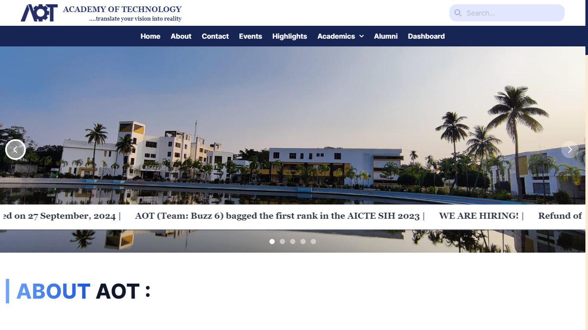
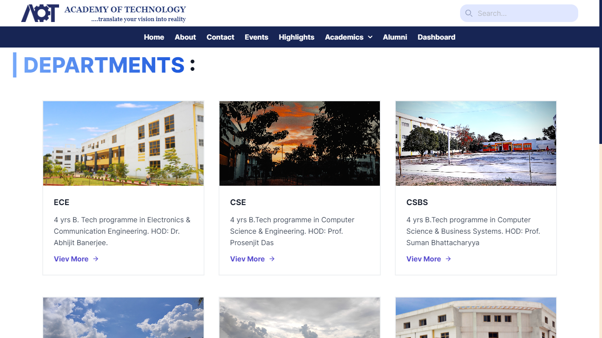
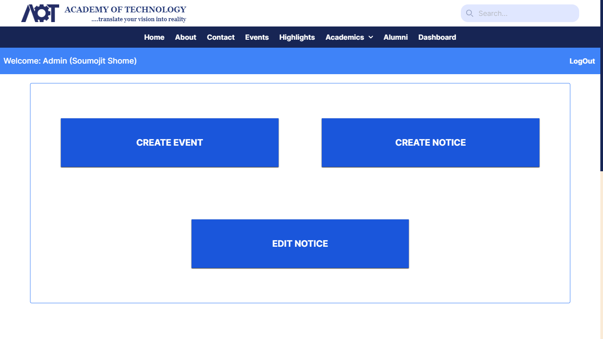
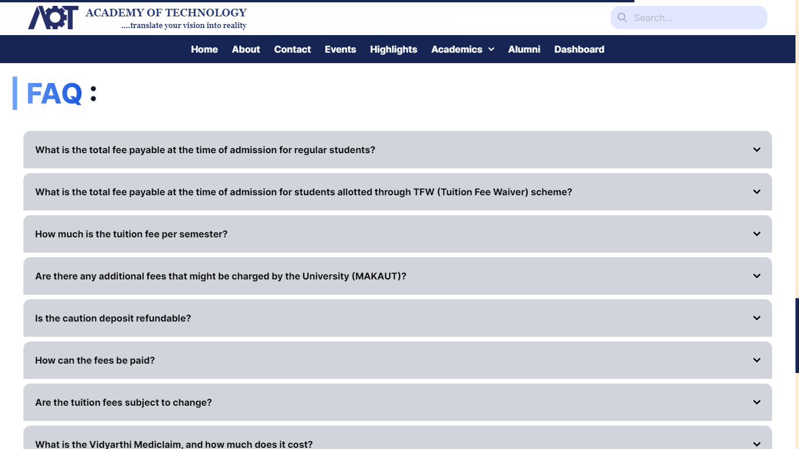
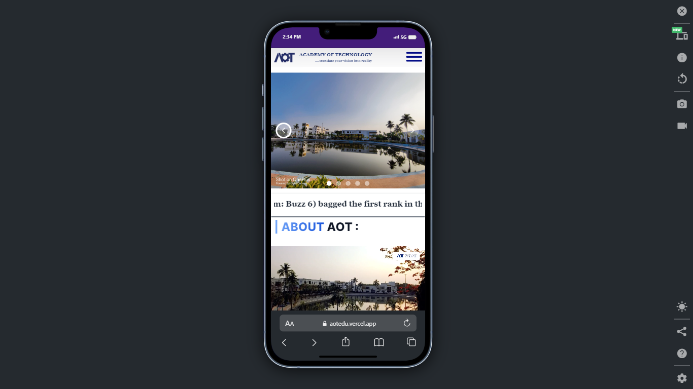
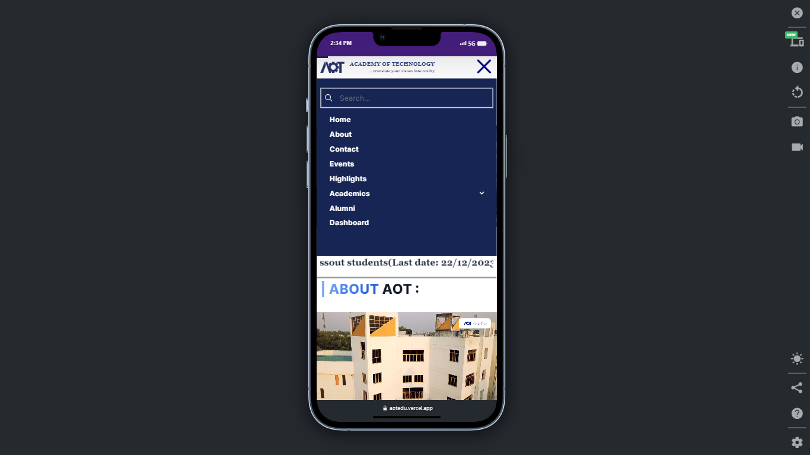
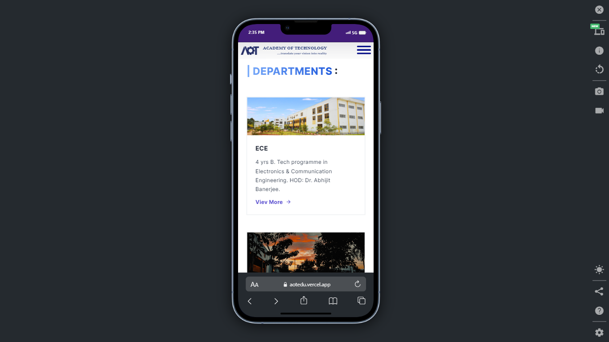
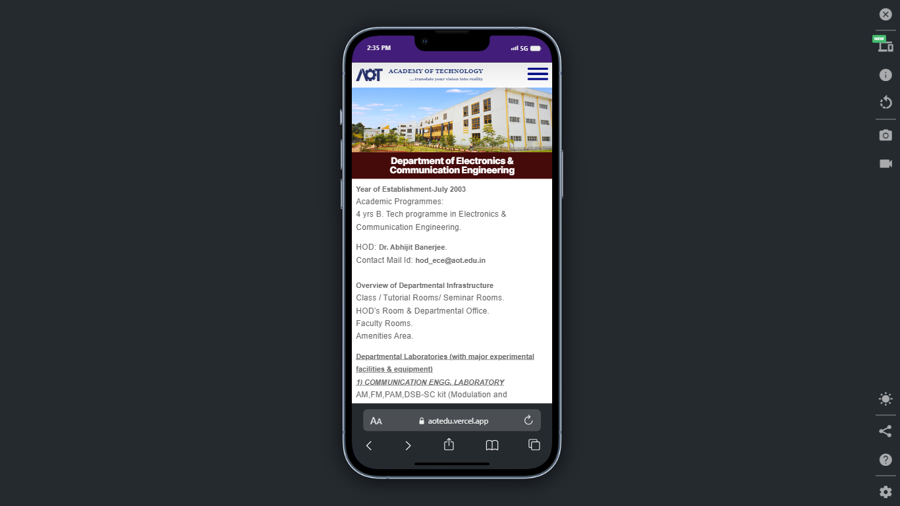
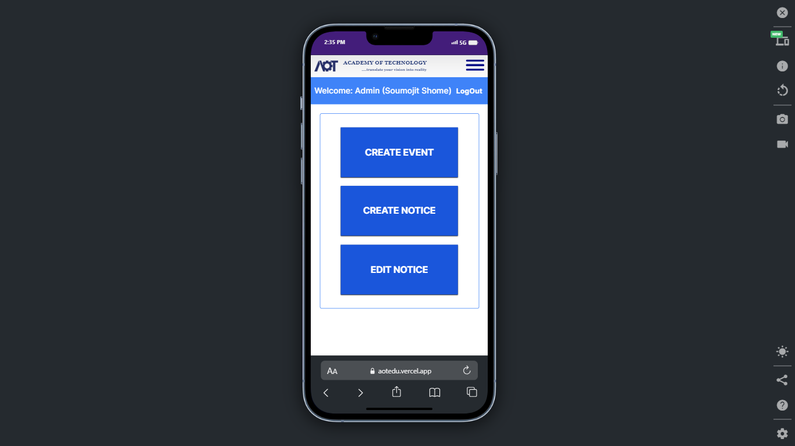

# [College Website](https://aotedu.vercel.app/)


<br />
<div align="center">
  <a target="_blank" href="https://github.com/Soumojitshome2023/college-website-nextjs">
    
  </a>

  <h3 align="center">College Website (Academy Of Technology)</h3>

  <p align="center">
    Welcome to the official repository for the Academy of Technology's college website. This project is developed as part of a college-level website design challenge. The website provides comprehensive information about the college, including events, notices, departments, and more.
    <br />
    <br />
    <a target="_blank" href="https://aotedu.vercel.app/">Live Link</a>
    ·
    <a target="_blank" href="https://github.com/Soumojitshome2023/college-website-nextjs">Repo Link</a>
    ·
    <a href="mailto:soumojitshome2021@gmail.com">Mail Us</a>
  </p>
</div>

## 💻 Demo
<iframe width="100%" height="400" src="https://www.youtube.com/embed/_-p8Iu8Mq7I?si=w5PXyQKkkesawc0F" title="YouTube video player" frameborder="0" allow="accelerometer; autoplay; clipboard-write; encrypted-media; gyroscope; picture-in-picture; web-share" allowfullscreen></iframe>

<!-- TABLE OF CONTENTS -->
<details>
  <summary> 🔰 Table of Contents</summary>
  <ol>
    <li><a href="#🛠%EF%B8%8F-tech-stack">Tech Stack</a></li>
    <li><a href="#🎉-features">Features</a></li>
    <li>
      <a href="#✨-screenshots">Screenshots</a>
     <ul>
      <li><a href="#💻-desktop-view">Desktop View</a></li>
      <li><a href="#📱-mobile-view">Mobile View</a></li>
    </ul>
    </li>
    <li><a href="#✨-installation">Installation</a></li>
    <li><a href="#✨-usage">Usage</a></li>
    <li><a href="#✨-developers">Developers</a></li>
  </ol>
</details>

## 🛠️ Tech Stack

This project utilizes the following technologies:

- **Next.js**: A React framework for building server-side rendered and static web applications.
- **MongoDB**: A NoSQL database for storing application data.
- **Node.js**: A JavaScript runtime for executing server-side code.
- **Express.js**: A web application framework for Node.js.
- **jsonwebtoken**: A library for creating and verifying JSON Web Tokens (JWT) for authentication.
- **Tailwind CSS**: A utility-first CSS framework for designing responsive user interfaces.
- **bcrypt**: A library for hashing passwords.
- **Cloudinary**: A cloud-based service for managing images and videos.
- **cookie-parser**: Middleware for parsing cookies.
- **GitHub**: Version control and collaboration platform.
- **nextjs-toploader**: A loading indicator component for Next.js.


<div style="display: flex; justify-content: center; flex-wrap: wrap; gap: 10px;">

 


 

 

 

 


 


</div>

<p align="right">(<a href="#college-website">back to top</a>)</p>

## 🎉 Features

The website includes the following features:

1. **Admin Authentication**: Secure login system for admin users.
2. **Admin Dashboard**: Interface for admins to manage website content.
3. **Create Event**: Admins can create new events.
4. **Edit Event**: Admins can edit existing events.
5. **Responsive UI**: The website is fully responsive and works on all devices.
6. **Current Notice Line**: Displays the latest notices for students and staff.
7. **About Section**: Information about the college.
8. **Upcoming Event Section**: Lists future events at the college.
9. **Highlights Section**: Showcases important achievements and news.
10. **Departments Section**: Information about various departments.
11. **FAQ Section**: Frequently asked questions and their answers.
12. **Syllabus Option**: Provides syllabus for all departments.
13. **Contact Option**: Contact form and details for reaching out to the college.

## **🔰 Important Feature :** 
* #### Admin Authentication

The website includes a robust admin authentication system. **Upon signup, new admin account is created, but he/she is not immediately granted access to the admin dashboard.** Instead, they undergo verification by a designated **"super admin"** from our database.

* #### Super Admin: The Database Owner

Only super admins have the authority to approve new admin accounts. This verification step ensures that only authorized individuals gain access to the admin dashboard and its functionalities.

* #### Admin Dashboard Access

Once verified by a super admin, admin users gain access to the admin dashboard. From there, they can perform various tasks such as adding, editing, and managing events, as well as other administrative duties.

This two-step authentication process enhances security and control over admin access to the website's backend functionalities.


<p align="right">(<a href="#college-website">back to top</a>)</p>

## ✨ Screenshots

### 💻 Desktop View :

####  ✨  Home Page :



#### ✨  Departments Page :




#### ✨  Admin Dashboard Page :



#### ✨  FAQ Section :



<p align="right">(<a href="#college-website">back to top</a>)</p>

### 📱 Mobile View :

#### ✨  Home Page :




#### ✨  Departments Page :




### ✨  Admin Dashboard Page :

[]()

<p align="right">(<a href="#college-website">back to top</a>)</p>

## ✨ Installation

To set up the project locally, follow these steps:

1. Clone the repository:

   ```sh
   git clone https://github.com/Soumojitshome2023/college-website-nextjs

   ```
2. Install the dependencies:

   ```sh
   npm install
   
   ```
3. Set up environment variables. Create a `.env` file in the root directory and add the following variables:

   * Client :
   
   ```sh
    NEXT_PUBLIC_BASEURL=http://localhost:3000
    NEXT_PUBLIC_SERVERURL=http://localhost:4000
    NEXT_PUBLIC_CLOUDNAME=
    NEXT_PUBLIC_UPLOAD_PRESET=
    NEXT_PUBLIC_CLOUD_FOLDER=college_website
   ```

   * Server :

   ```sh
   MONGO_URI=
   FRONTEND_URI=http://localhost:3000
   REFRESH_TOKEN_KEY=
   ACCESS_TOKEN_KEY=
   PORT=4000
   ```
4. Run the development server:

   ```sh
   npm run dev
   ```


## ✨ Usage

To use the website, navigate to `http://localhost:3000` in your browser. Admin users can log in to access the admin dashboard and manage content.

<p align="right">(<a href="#college-website">back to top</a>)</p>

---


## ✨ Developers :

<div>
  <h1 align="center">
    <b>Made with ❤️ by team NextGenDev</b>
  </h1>
</div>
Meet the awesome people who have contributed to this project:


<br />


<table>
  <tr>
    <td align="center">
      <a href="https://github.com/Soumojitshome2023">
        
        <br />
        <sub><b>Soumojit Shome[Lead]</b></sub>
      </a>
    </td>
    <td align="center">
      <a href="https://github.com/Rick-03">
        
        <br />
        <sub><b>Satwick Mukherjee</b></sub>
      </a>
    </td>
    <td align="center">
      <a href="https://github.com/ritesh2004">
        
        <br />
        <sub><b>Ritesh Pramanik</b></sub>
      </a>
    </td>
    <td align="center">
      <a href="https://github.com/DebojyotiDe03">
        
        <br />
        <sub><b>Debojyoti De</b></sub>
      </a>
    </td>
  </tr>
</table>


<p align="right">(<a href="#college-website">back to top</a>)</p>

## Thank You ...
