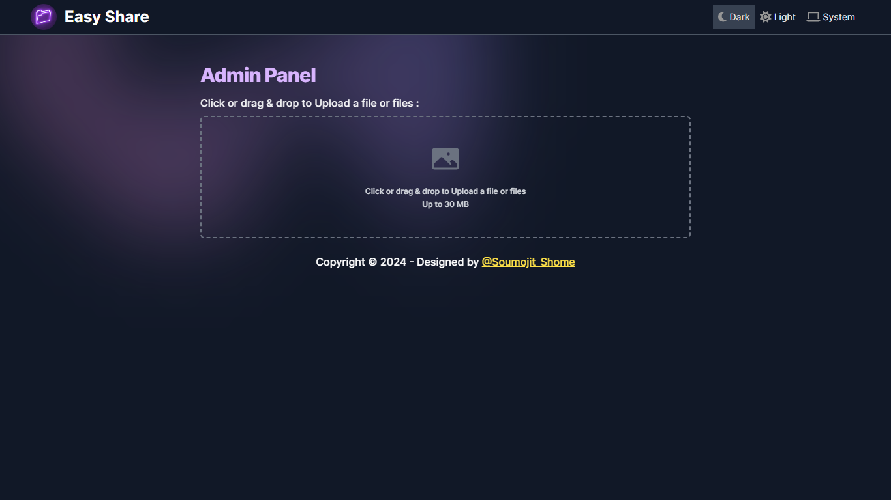
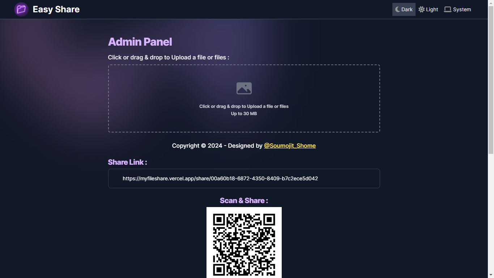
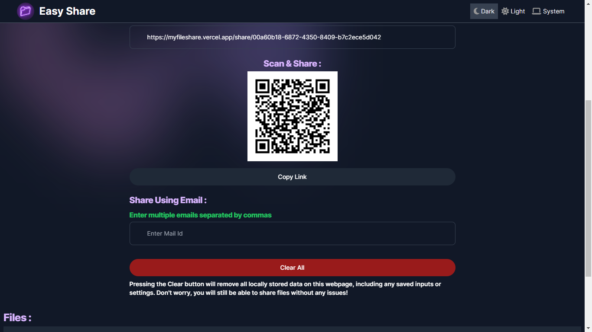
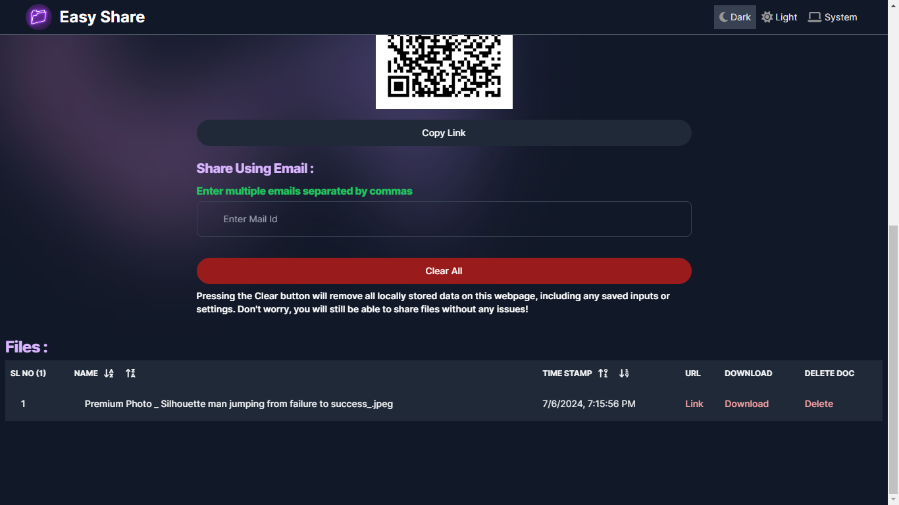

# [File Sharing Web App](https://myfileshare.vercel.app/)

## File Sharing Web App
This project is a simple file sharing web application built using Next.js, Firebase, Nodemailer, and Tailwind CSS.

🔥 **Version : V 1.0.0**

🔥 **Project Link :** [Click to Visit Website](https://myfileshare.vercel.app/) ✨

## Features
* **File Uploading:** Users can upload files to the server.
* **QR & Share Link Generation:** After uploading files, users receive a shareable link & QR that can be sent via email.
* **Email Integration:** Users can input email addresses to send the shareable link directly to recipients.
* **Secure Download:** Anyone with the shareable link can securely download the shared file.
Technologies Used
* **Next.js:** A React framework for building server-rendered applications.
* **Firebase:** Provides backend services like authentication, storage, and database.
* **Nodemailer:** Node.js module for sending emails.
* **Tailwind CSS:** A utility-first CSS framework for building custom designs quickly.

## 🚀 Upload File:

## 🚀 File/Files:

## 🚀 Video:

<iframe width="100%" height="315" src="https://www.youtube.com/embed/vUHtV9IH2c8?si=g7asxct0VdsalB1t" title="YouTube video player" frameborder="0" allow="accelerometer; autoplay; clipboard-write; encrypted-media; gyroscope; picture-in-picture; web-share" allowfullscreen></iframe>

## **Thank You ...** 🤗🙂