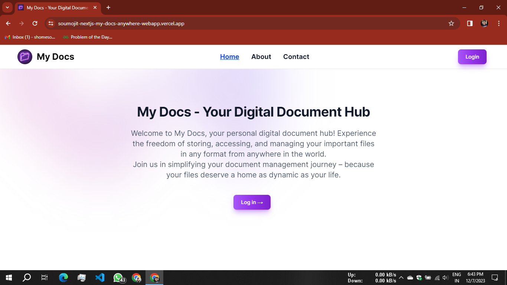
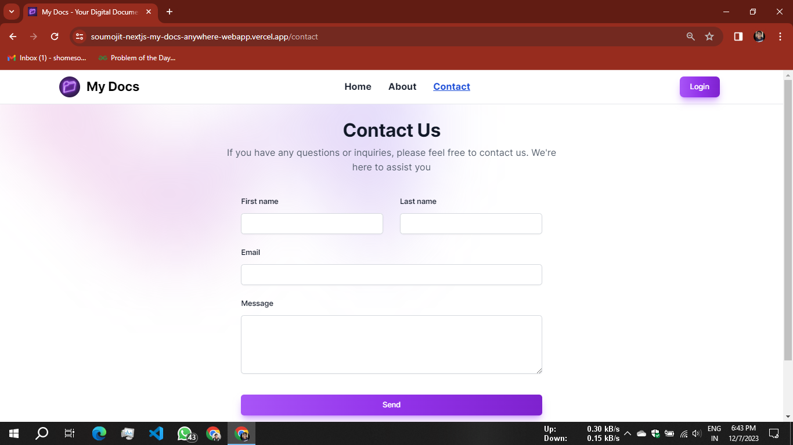
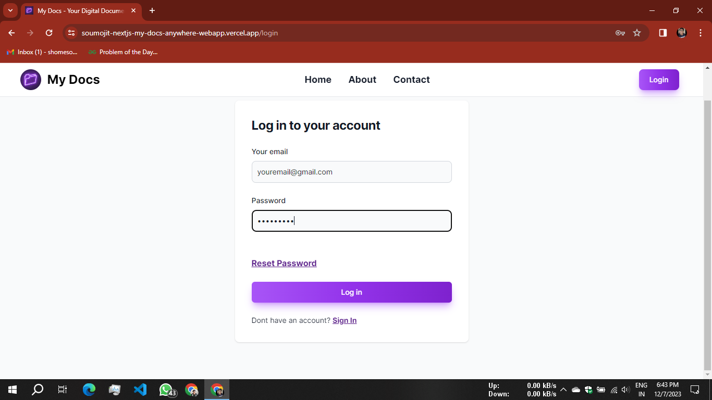
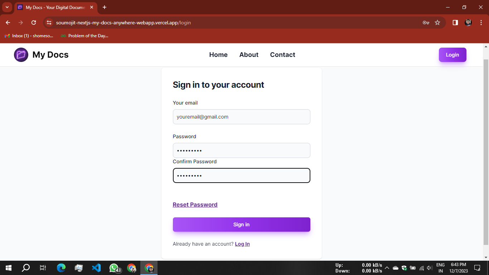
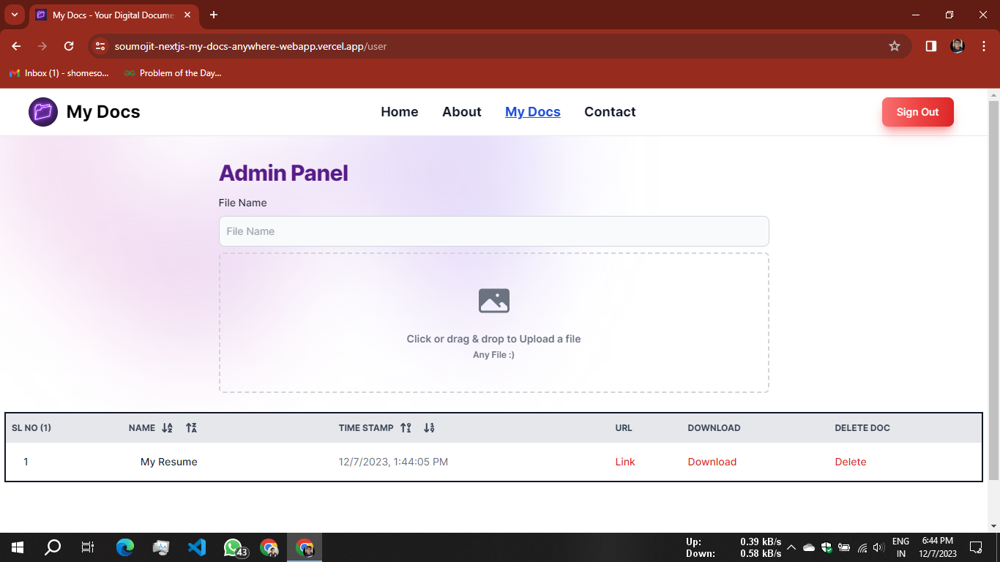

# [# My Docs](https://mydocshub.vercel.app/)

## 🚀 Exciting Announcement! 🚀

I am thrilled to introduce "**[My Docs](https://mydocshub.vercel.app/)**" – Your Ultimate Digital Document Hub! 📂✨

#### 🌐 **Project Overview: "My Docs" - Your Ultimate Digital Document Hub**:

" **My Docs** " is a groundbreaking project designed with one clear purpose – to revolutionize the way you manage and interact with your digital documents. In a world where information is key, **"My Docs"** strives to provide users with a seamless and secure platform for storing, organizing, and accessing their files from anywhere, at any time.

### Version : V 1.0.0

🔥 **WebSite Link :** [Click to Visit Website](https://mydocshub.vercel.app/)

🔥 **Video Link :** [Click to Visit YouTube Video](https://youtu.be/4Ah9zJJ2354?si=rInuyPzT0BJ6FQN3)

🔥 **LinkedIn Post Link :** [Click to Visit LinkedIn Post](https://www.linkedin.com/posts/soumojit-shome_nextjs-firebase-tailwindcss-activity-7138542690161381376-IoMc?utm_source=share&utm_medium=member_desktop)

## ✨ **Key Features:**

- 🔒 **Secure Email Password Authentication:** Your documents, your privacy! We prioritize the security of your valuable files with a robust email and password authentication system.
- 🔄 **Forget Password Option:** No need to worry about forgotten passwords! Easily reset your credentials to regain access and peace of mind.
- 🗑️ **Delete Document:** Have control over your data! Effortlessly manage your files by deleting them whenever needed, ensuring a clutter-free digital space.
- 📥 **Download Document:** Seamlessly download your documents in their original format with a simple click. Your files, your way!
- 📬 **Contact Us:** Have questions or feedback? We're here for you! Reach out through our user-friendly "Contact Us" feature.
- 🚪 **Automatic Logout:** Your security is our priority. Experience peace of mind with automatic logout after cloning the page.
- 📤 **Drag and Drop Feature:** Streamlined file management! Effortlessly upload your documents with the intuitive drag-and-drop feature.
- 🔄 **File Upload and Download Compatibility:** No restrictions! Upload and download documents in any format. "My Docs" supports all file types.
- 🔄 **File Renaming on Upload:** Personalize your digital space! Easily rename your documents during the uploading process.
- 🌐 **Access Anywhere:** Your documents, wherever you are! Enjoy the freedom to access your files from any location with an internet connection.
- 🌈 **User-Friendly Interface:** Navigating "My Docs" is a breeze! Our user-friendly interface ensures a smooth and enjoyable experience.

## 🚀✨ **Tech Stack Highlights: 🚀**

- 🚀 **Next.js:** Elevating the user experience with lightning-fast performance and seamless navigation. The future of web development is here!
- 🔥 **Firebase:** Powering the backend with a robust and scalable infrastructure. Say hello to secure authentication, real-time updates, and hassle-free data storage.
- 🎨 **Tailwind CSS:** Bringing style to substance! Crafting a stunning and responsive user interface that's as sleek as it is user-friendly.

## 🚀 **Learning Journey: "My Docs" Development** 🚀

Embarking on an exciting learning journey! Here are the key topics covered in the development of "**My Docs**" – Your Ultimate Digital Document Hub. 🌐📄

1. **Firebase Authentication:**

   - 🔐 Secure user authentication using Firebase. Explore email and password authentication for a robust login system.
2. **Firebase Firestore:**

   - 📋 Learn the ins and outs of Firebase Firestore for efficient and scalable real-time database operations.
3. **Firebase Storage:**

   - 📁 Master Firebase Storage for seamless and secure file uploads and downloads.
4. **Next.js Routing:**

   - 🚦 Dive into Next.js routing to create a dynamic and smooth user navigation experience.
5. **Next.js Loading:**

   - ⌛️ Optimize user experience with Next.js loading strategies for efficient content delivery.
6. **Next.js Page Not Found:**

   - 🚧 Handle page not found scenarios gracefully with Next.js custom error pages.
7. **Drag and Drop File:**

   - 🚀 Implement the intuitive drag-and-drop feature for an enhanced and user-friendly file uploading experience.
8. **Email Password Authentication:**

   - 📧 Understand the intricacies of email-password authentication for a secure user login system.
9. **File Download using Axios:**

   - ⬇️ Explore Axios to facilitate easy and efficient file downloads directly from your application.
10. **Tailwind CSS Usage:**

    - 🎨 Harness the power of Tailwind CSS to craft a visually appealing and responsive user interface.
11. **CRUD Operations:**

    - 🔄 Master CRUD (Create, Read, Update, Delete) operations for seamless data management within your application.
12. **State Management:**

    - 🔄 Explore state management techniques for maintaining a consistent application state.
13. **Error Handling:**

    - 🚨 Implement effective error handling mechanisms for a smooth user experience.
14. **Responsive Design:**

    - 📱 Ensure a consistent and visually pleasing user experience across various devices with responsive design principles.

## 🚀 **Future Plans: Elevating "My Docs" Experience** 🚀

The journey is evolving, and we've got some exciting plans to further elevate your experience with "My Docs" – Your Ultimate Digital Document Hub. 🌐🚀

1. **Clean and Attractive UI:**
   * ✨ Unveil a revamped, more polished UI design for "My Docs," ensuring an even smoother and visually captivating user experience.
2. **Integration with Cloud Services:**
   * ☁️ Take your document management to the next level with seamless integration with popular cloud services, providing extended flexibility and storage options.
3. **Enhanced Accessibility Features:**
   * ♿ Prioritize inclusivity by introducing advanced accessibility features, making "My Docs" user-friendly for individuals with diverse needs.
4. **Fortified Security Measures:**
   * 🔐 Strengthen security protocols to fortify user data, introducing advanced encryption and additional layers of protection for utmost user confidence.
5. **Scalability for Growing Users:**
   * 🚀 Prepare for growth! Optimize "My Docs" infrastructure to handle more users simultaneously, ensuring a smooth experience even during peak usage.
6. **Smart User Authentication:**
   * 🤖 Implement smart user authentication mechanisms, providing an added layer of identity verification for enhanced security.

## 🚀 Home Page:

## 🚀 Contact Page:

## 🚀 LogIn Page:

## 🚀 SignIn Page:

## 🚀 Admin Page:

Ready to experience the perfect synergy of Next.js, Firebase, and Tailwind CSS? Explore "My Docs" and witness innovation in action! 🚀💻✨ [Explore My Docs](https://mydocshub.vercel.app/) #NextJS #Firebase #TailwindCSS #WebDevelopment #InnovationInTech #MyDocsTechStack

---

## 🚀 Video:

<iframe width="100%" height="315" src="https://www.youtube.com/embed/4Ah9zJJ2354?si=rFxqIzlyNzAmX3gS" title="YouTube video player" frameborder="0" allow="accelerometer; autoplay; clipboard-write; encrypted-media; gyroscope; picture-in-picture; web-share" allowfullscreen></iframe>

## **Thank You ...** 🙂🤗