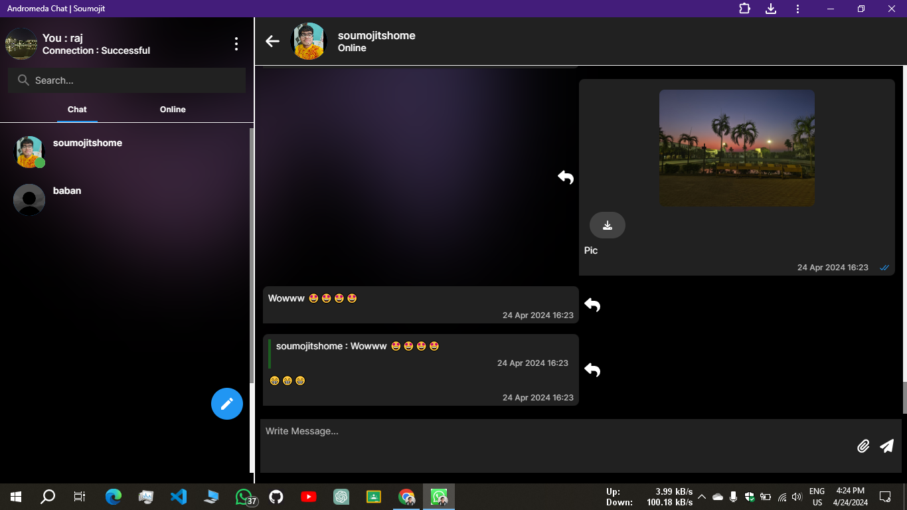

# [NextJs Chat WebApp](https://andromedachat.vercel.app/)

## 🎉 Andromeda Chat WebApp with Next.js! 🌐✨
   

Andromeda Chat is a real-time chat application designed to provide seamless communication between users, With various features and various messaging functionalities.

Project Link : [Click to Visit Website](https://andromedachat.vercel.app/) ✨

## **Features :**
* **Sign Up:** Easily create an account with just a few simple steps.
* **Login:** Securely log in to your account using your credentials.
* **Forgot Password Option:** Easily recover your account if you forget your password.
* **Send Chat:** Send messages in real-time to your contacts.
* **Receive Chat:** Instantly receive messages from your contacts.
* **Online Status:** See the online status of your friend.
* **Typing Status:** See the typing status of your friend.
* **Message Seen Status:** See the message status of your friend.
* **Image Send Option:** Share images with your friend.
* **Doc Send Option:** Share documents with your friend.
* **Reply Chat Option:** Reply to specific messages for better conversation organization.
* **New Chat Notifications:** Receive notifications for new chat messages.
* **Edit User Display Picture:** Customize your profile by changing your display picture.
* **Edit Name:** Personalize your profile by editing your name.
* **Dark/Light System Mode:** Enjoy chatting in your preferred theme mode.
* **Online User Tab:** View a list of users who are currently online.
* **All User Tab:** Access a comprehensive list of all users registered on the platform.
* **Download Pic/Doc Option:** Download pictures or documents from the chat.

## **Technology Stack :**
Andromeda Chat is built using the following technologies:

* **Next.js:** A React framework for building server-side rendered and statically generated web applications.
* **MongoDB:** A NoSQL database for storing user data.
* **Cloudinary:** A cloud-based image and video management solution for image storage and manipulation.
* **Tailwind CSS:** A utility-first CSS framework for styling the application.
* **Socket.IO:** A library that enables real-time, bidirectional, and event-based communication between web clients and servers.
* **Node.js:** A JavaScript runtime for building scalable network applications.

Project Link : [Click to Visit Website](https://andromedachat.vercel.app/) ✨

---

## Page Pic:
 

---

#NextJS #WebDevelopment
Check out the app [Click to Visit Website](https://andromedachat.vercel.app/)