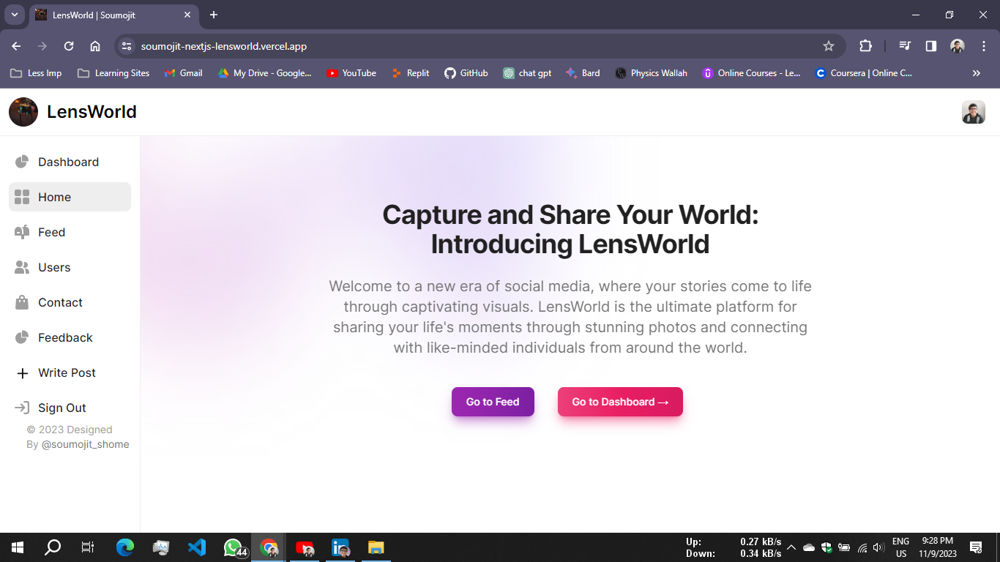
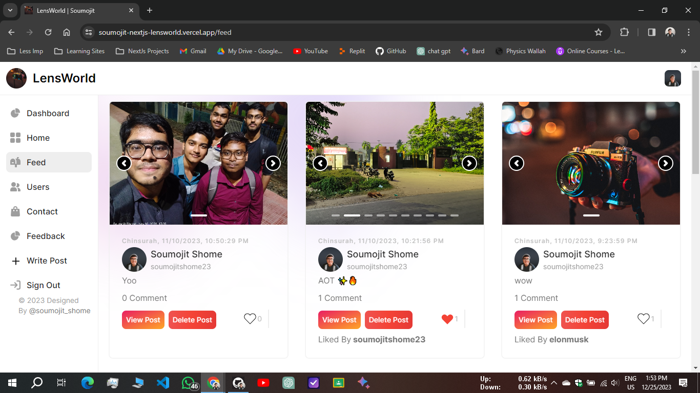
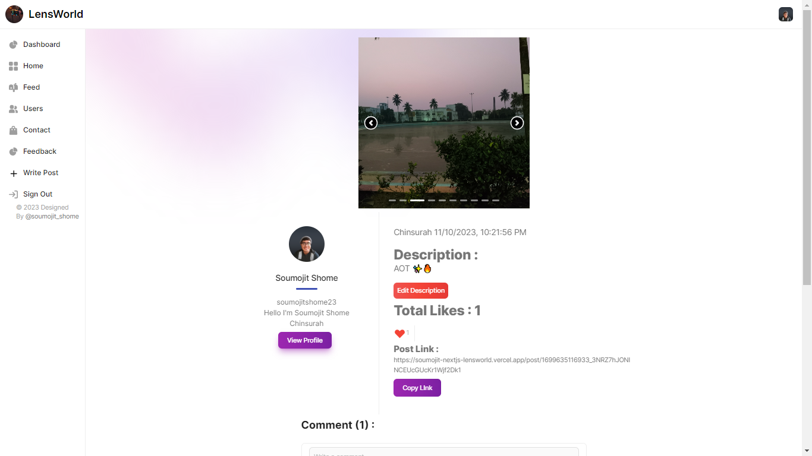
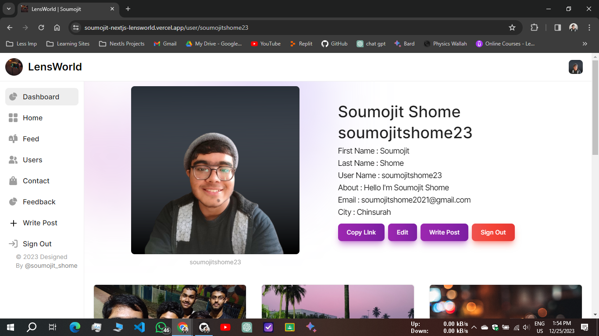

# 🚀 Exciting News! 🚀

I'm thrilled to announce the successful completion of my latest project – a cutting-edge social media web application built with Next.js and Firebase! 🌟

With this dynamic web app, users can seamlessly post multiple photos, express themselves with likes, shares, and comments, and even delete posts to curate their content. The platform also offers a personalized feed option, ensuring that users stay engaged with the content that matters most to them.

What sets this project apart is its user-friendly interface and robust functionality. Not only does it support Google Sign-In, but it also enables email sign-in for added convenience and accessibility.

🔑 Key Features:
- ✨ Multiple Photo Posting: Share your moments with the world by posting multiple photos in a single go.
- ❤️ Engagement Features: Like, share, and comment to interact with posts and connect with others.
- 🗑️ Post Management: Have full control over your content with the ability to delete posts whenever you want.
- 📰 Personalized Feeds: Enjoy a tailored experience with a feed.
- 🌐 Authentication Options: Choose between Google Sign-In and Email sign-in to access the platform effortlessly.

I'm incredibly proud of the work put into this project and the efforts that made it possible. This web application is not just a digital space; it's a vibrant community where users can express themselves.

I invite you to check out the web app and experience the seamless navigation. Thank you to everyone who supported this journey, and I look forward to seeing you all on the platform!

🔥 Special thanks to Swastik Bose, Priyadarshan Ghosh, Ritam Majumder 😊.

Project Link : [Click to Visit Website](https://soumojit-nextjs-lensworld.vercel.app/) ✨

Video Link : [Click to Visit YouTube Video](https://youtu.be/llMs_W74xwo?si=xwlPaqTv3eoxxO_M)

LinkedIn Post Link : [Click to Visit LinkedIn Post](https://www.linkedin.com/posts/soumojit-shome_socialmedia-nextjs-firebase-activity-7128411412804059136-XxQr?utm_source=share&utm_medium=member_desktop)

#### 🚀 Home Page:

#### 🚀 Feed:

#### 🚀 Post Page:

#### 🚀 User Profile Page:

#SocialMedia #NextJS #Firebase #WebDevelopment #Innovation #UserExperience #DigitalCommunity 🚀