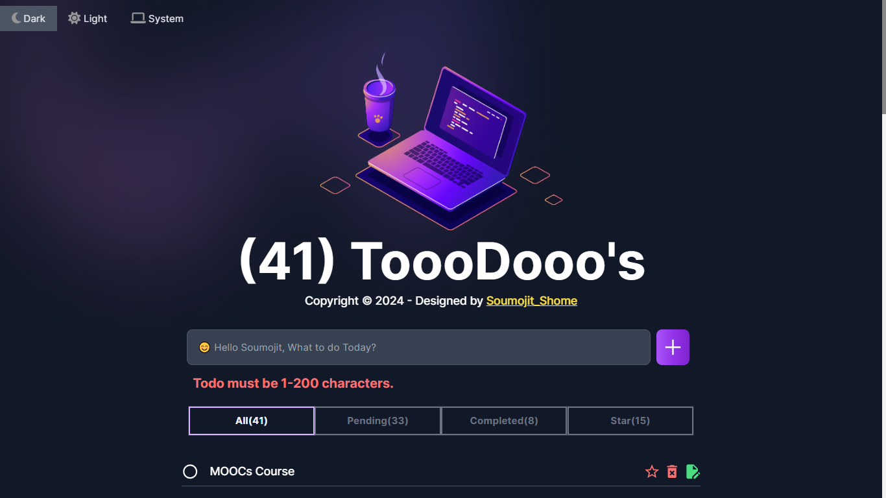

# [Todo WebApp](https://soumojit-nextjs-todoapp.vercel.app/)

---
# 🎉 Exciting News! Just Launched My New Todo WebApp with Next.js! 🌐✨

Hey everyone! I'm super excited to share my latest project – a cool Todo WebApp built using Next.js! 🚀✨

## Awesome Features:
🔐 Easy Sign-Up and Login: Now you can sign up or log in super easily, whether you prefer using Google or your email and password!
🔑 Forgot Your Password? Reset It Easily!: If you ever forget your password, no worries! Simply reset it with a secure and straightforward process. 🤝🔑
✅ Manage Your Tasks Effortlessly: Adding, deleting, starring, editing – you can do it all with a few clicks. Keep your to-do list in check and get things done with ease!
🎨 Personalize Your Space: Choose between a light or dark theme to make the app look just the way you like it. It's all about making your experience enjoyable!

Project Link : [Click to Visit Website](https://soumojit-nextjs-todoapp.vercel.app/) ✨

Video Link : [Click to Visit YouTube Video](https://youtu.be/q7iVh5_YvvM?si=WF-m_4ozf2oIb3C9)

LinkedIn Post Link : [Click to Visit LinkedIn Post](https://www.linkedin.com/posts/soumojit-shome_nextjs-webdevelopment-todoapp-activity-7139666822068420608-aduq?utm_source=share&utm_medium=member_desktop)

#### 🚀 SignUp Page:

#### 🚀 Log In:

#### 🚀 ToDos Page:

---

#### 🚀 Video:

<iframe width="100%" height="315" src="https://www.youtube.com/embed/q7iVh5_YvvM?si=6hFi2c_Z_eodaGw6" title="YouTube video player" frameborder="0" allow="accelerometer; autoplay; clipboard-write; encrypted-media; gyroscope; picture-in-picture; web-share" allowfullscreen></iframe>

#NextJS #WebDevelopment #TodoApp
Check out the app [Click to Visit Website](https://soumojit-nextjs-todoapp.vercel.app/) and start getting your tasks under control! 🌟🚀