### 🚗💨 **Building a WiFi-Controlled Car with ESP32** 💡🔧

I'm thrilled to share my recent project where I created a WiFi-controlled car using an ESP32 microcontroller, L298N motor driver, 4-wheel car chassis, and a Li-ion battery. 🚙✨

🔥 **Video Link :** [Video Link](https://youtu.be/FxY-Q4hZWhk)

🔥 **LinkedIn Post Link :** [Click to Visit LinkedIn Post](https://www.linkedin.com/posts/soumojit-shome_iot-embeddedsystems-esp32-activity-7217419747603140608-rZZz)

## Table of Contents

- [Table of Contents](#table-of-contents)
- [Introduction](#introduction)
- [Components](#components)
- [Assembly](#assembly)
- [Programming the ESP32](#programming-the-esp32)
  - [Setting Up the Environment](#setting-up-the-environment)
- [Learning Process](#learning-process)
- [Challenges and Solutions](#challenges-and-solutions)
- [Project Highlights](#project-highlights)
- [Images](#images)
  - [Car Chassis Setup](#car-chassis-setup)
  - [L298N Motor Driver](#l298n-motor-driver)
  - [Motor Interior View](#motor-interior-view)
  - [Programming the ESP32](#programming-the-esp32-1)
  - [Complete Structure](#complete-structure)
  - [Control Page](#control-page)
  - [ESP32 Board](#esp32-board)
- [Video](#video)

## Introduction

This project involves creating a WiFi-controlled car using an ESP32 microcontroller, L298N motor driver, 4-wheel car chassis, and a Li-ion battery. The car can be controlled wirelessly via a web interface using WebSockets.

## Components

* ESP32 Microcontroller
* L298N Motor Driver
* 4-Wheel Car Chassis
* Li-ion Battery
* Jumper Wires
* Breadboard (optional)
* USB Cable for Programming
* Computer with Arduino IDE

## Assembly

1. **Car Chassis Setup** : Assemble the 4-wheel car chassis as per the manufacturer's instructions. Attach the motors to the chassis.
2. **Connecting the Motor Driver** : Connect the motors to the L298N motor driver.

   * Connect motor A to the OUT1 and OUT2 terminals.
   * Connect motor B to the OUT3 and OUT4 terminals.

3. **Connecting ESP32 to Motor Driver** :

    * IN1 -> GPIO 2
    * IN2 -> GPIO 4
    * IN3 -> GPIO 16
    * IN4 -> GPIO 17
    * ENA -> not connected
    * ENB -> not connected

4. **Power Connections** :

    * Connect the ESP32's VIN to the 5V output of the L298N.
    * Connect the GNDs together.

## Programming the ESP32

### Setting Up the Environment

1. **Install Arduino IDE**
2. **ESP32 Board Setup** 
3. **Library Installation** 

## Learning Process

- **ESP32**: Understanding its capabilities and how to program it.
- **L298N Motor Driver**: Learning its functionalities and how to control it.
- **Arduino Basics**: Refreshing my knowledge and applying it in this project.
- **WebSocket**: Integrating WebSocket for real-time communication.

## Challenges and Solutions

1. **Programming ESP32 with WebSocket** :

   * **Challenge** : Integrating WebSocket for real-time control.
   * **Solution** : Used `WebSocketsServer` library to establish communication and control signals.

2. **Car Chassis Setup** :

   * **Challenge** : Properly assembling the car chassis and connecting all components.
   * **Solution** : Followed detailed assembly guides and ensured secure connections.

3. **Control Page Design** :

   * **Challenge** : Creating an intuitive web interface for car control.
   * **Solution** : Designed a simple HTML/CSS interface with JavaScript for WebSocket communication.

## Project Highlights

- Real-time control via WebSocket.
- Smooth motor control with PWM signals.
- A user-friendly web interface for controlling the car.

Feel free to reach out if you have any questions or are working on similar projects. Let's connect and share our experiences! 🚀

## Images

### Car Chassis Setup
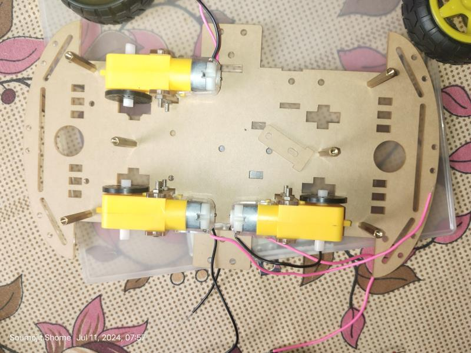
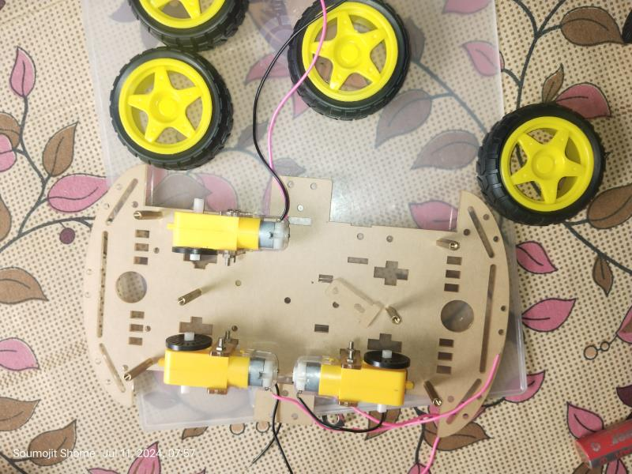
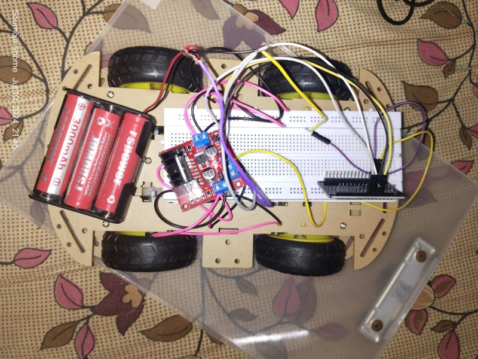

### L298N Motor Driver
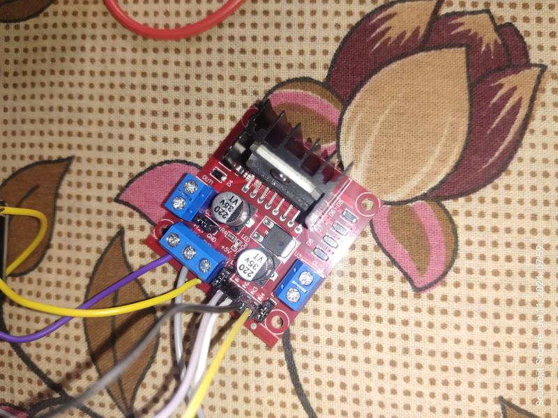
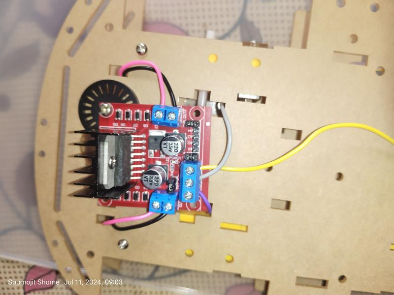

### Motor Interior View
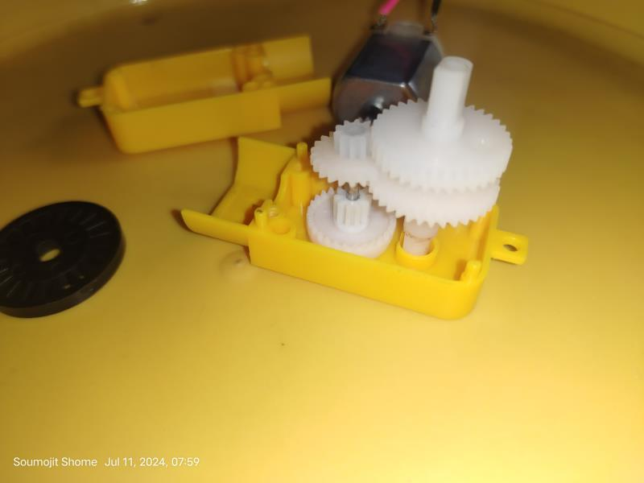
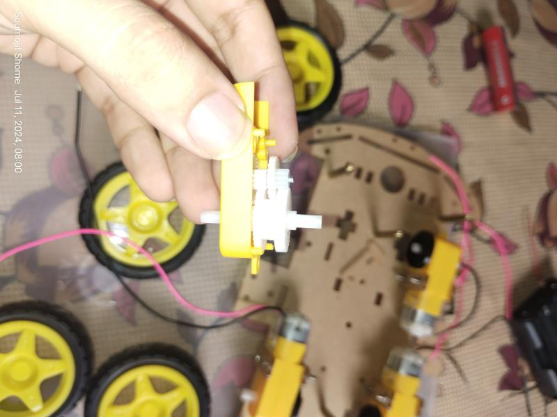
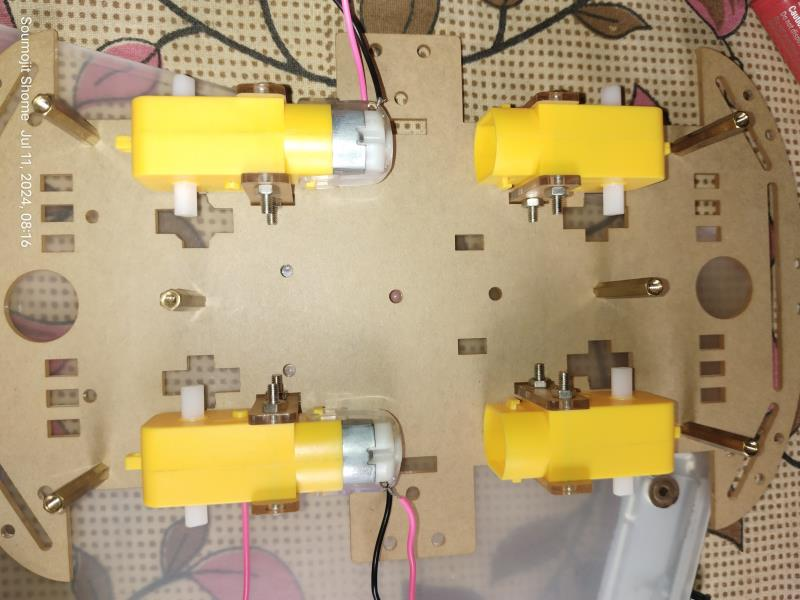

### Programming the ESP32
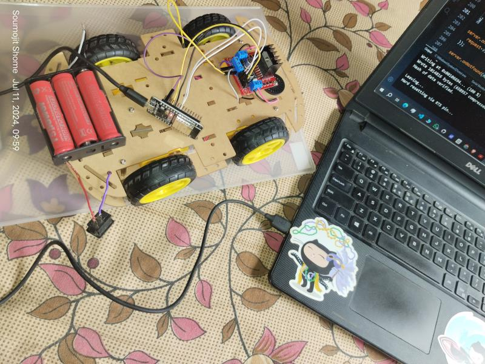
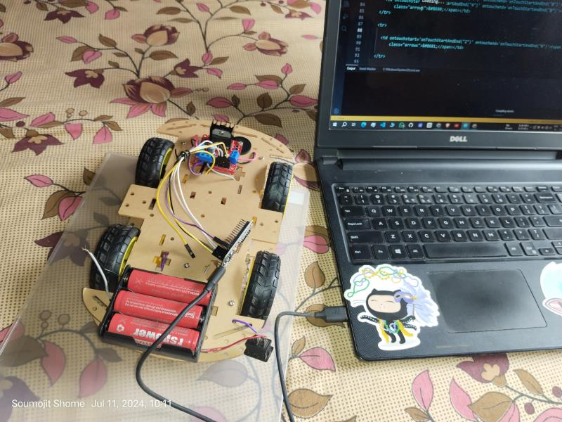

### Complete Structure
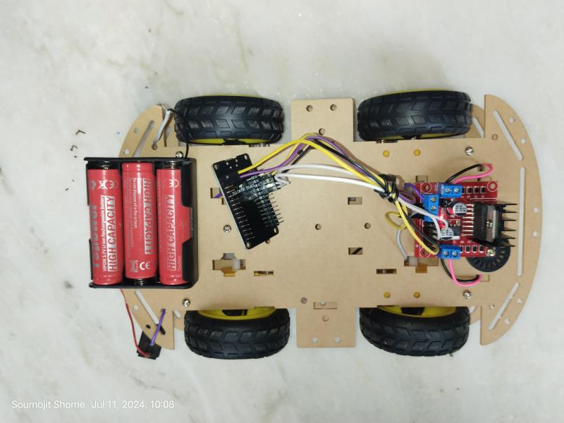
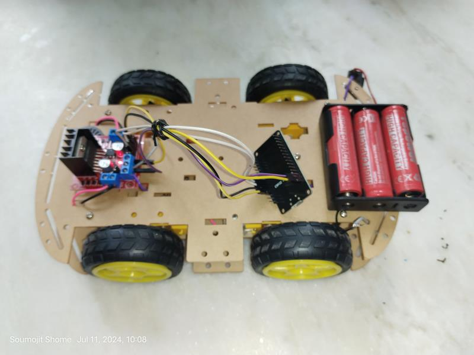
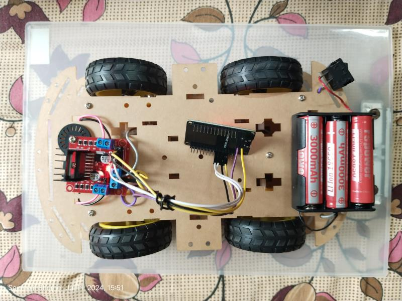
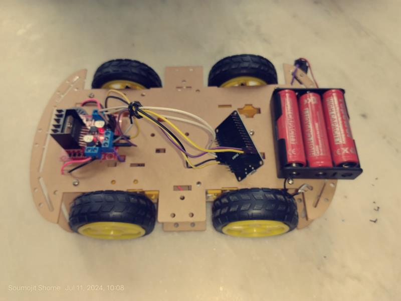
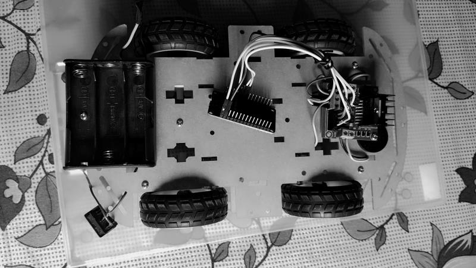

### Control Page
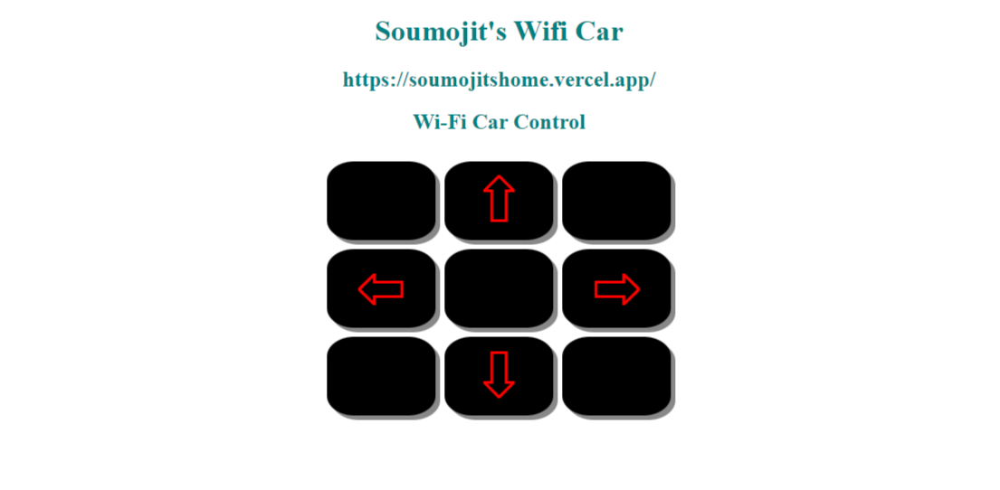

### ESP32 Board
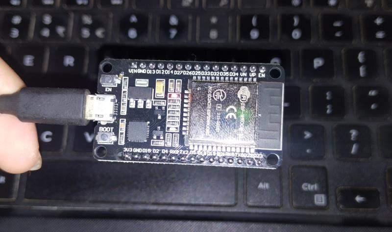

## Video

<iframe width="100%" height="315" src="https://www.youtube.com/embed/FxY-Q4hZWhk?si=U1Bip_5SnFE8WRr6" title="YouTube video player" frameborder="0" allow="accelerometer; autoplay; clipboard-write; encrypted-media; gyroscope; picture-in-picture; web-share" allowfullscreen></iframe>

#IoT #EmbeddedSystems #ESP32 #WebSocket #Arduino #TechProjects #Innovation #LearningByDoing
